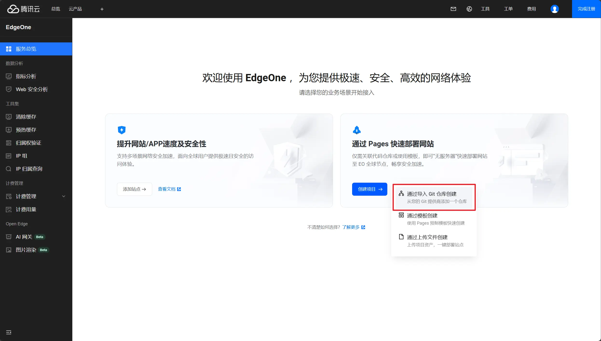
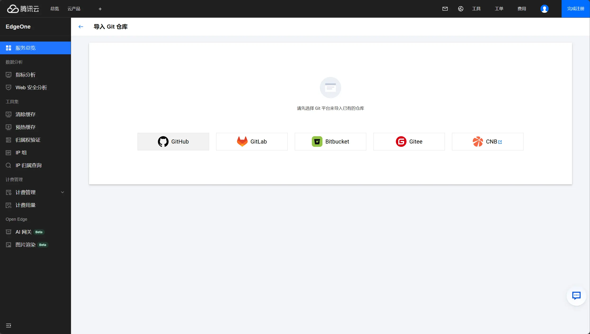
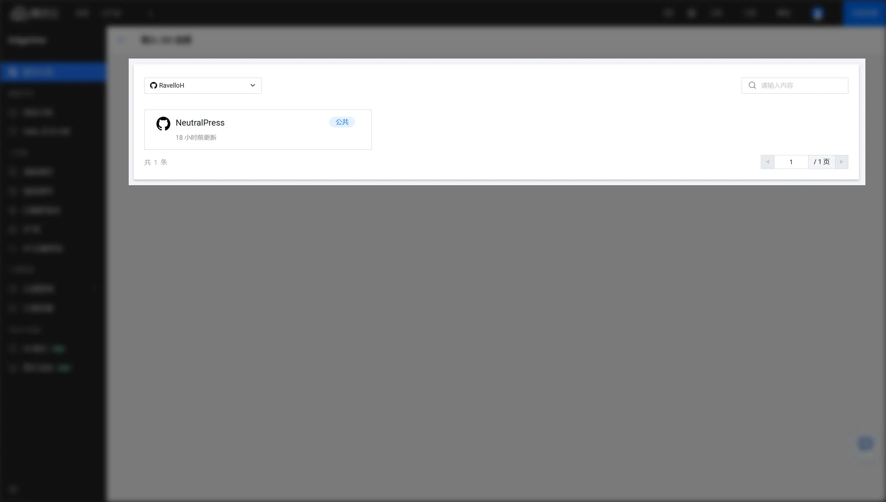
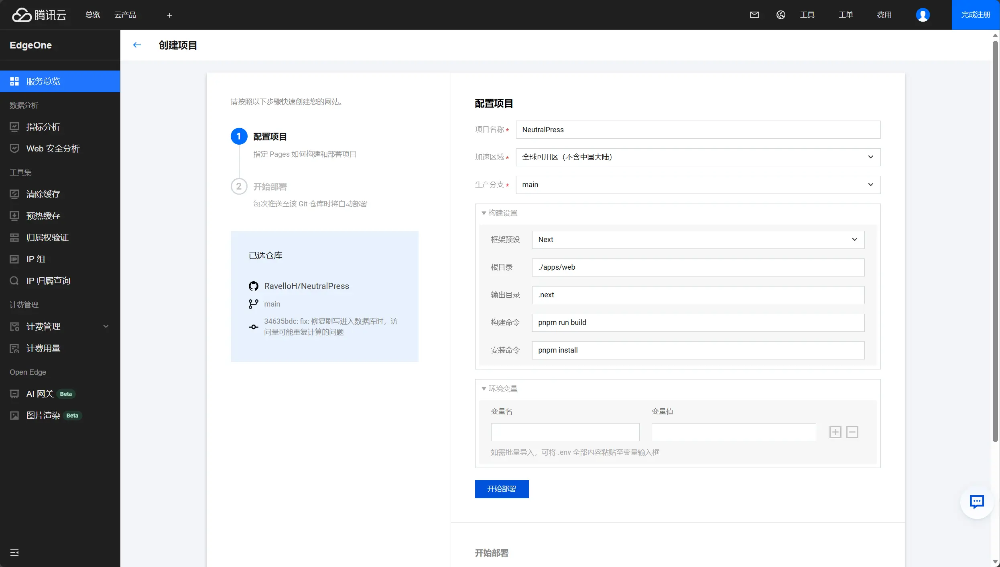

下面我们在腾讯云 EdgeOne 上部署 NeutralPress。由于 EdgeOne 不提供 PostgresSQL 和 Redis 云服务，我们需要先单独获取这些服务。

请先参考 [PostgreSQL 云服务](/docs/deploy/cloud#postgressql-云服务) 和 [Redis 云服务](/docs/deploy/cloud#redis-云服务)页面，先获取 PostgreSQL 和 Redis 的连接字符串，并写在下方：

<ConfigForm label="DATABASE_URL" />
<ConfigForm label="REDIS_URL" />

## 步骤

### Fork 仓库

首先，在 GitHub 上 Fork 项目到自己的账号下。

### 创建 EdgeOne 项目
前往 [腾讯云 EdgeOne](https://console.tencentcloud.com/edgeone) 并登录你的账号。随后，点击创建项目-通过导入 Git 仓库创建

你还需要绑定你的 GitHub 账号，以便 EdgeOne 可以访问你的仓库：

然后，选择你刚才 Fork 的 NeutralPress 仓库：

### 配置部署设置

按以上照片进行设置：

- 框架预设: `Next`
- 根目录: `./apps/web`
- 输出目录: `.next`
- 构建命令: `pnpm run build`
- 安装命令: `pnpm install`

### 配置环境变量

<ConfigForm output="base64" />

全部复制后，一键粘贴即可全部自动导入。

