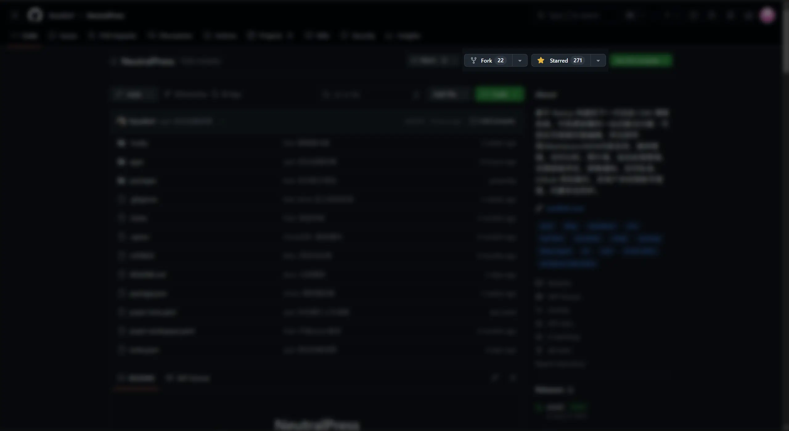
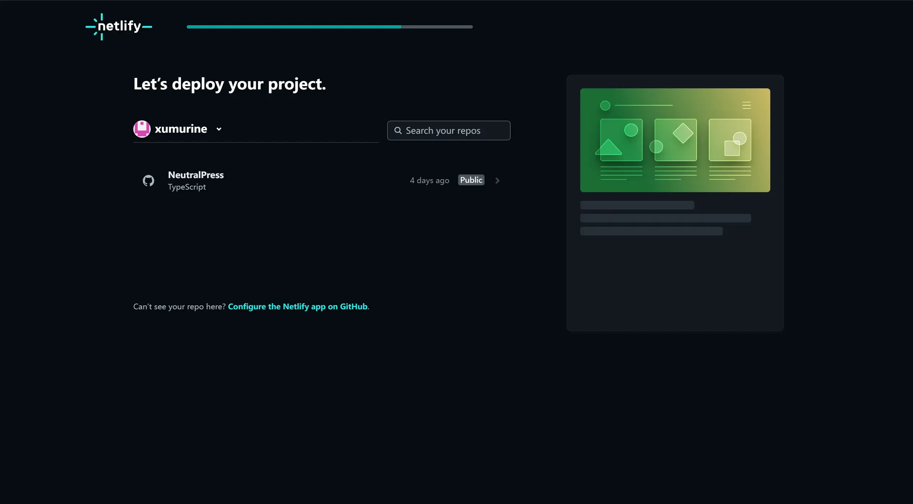
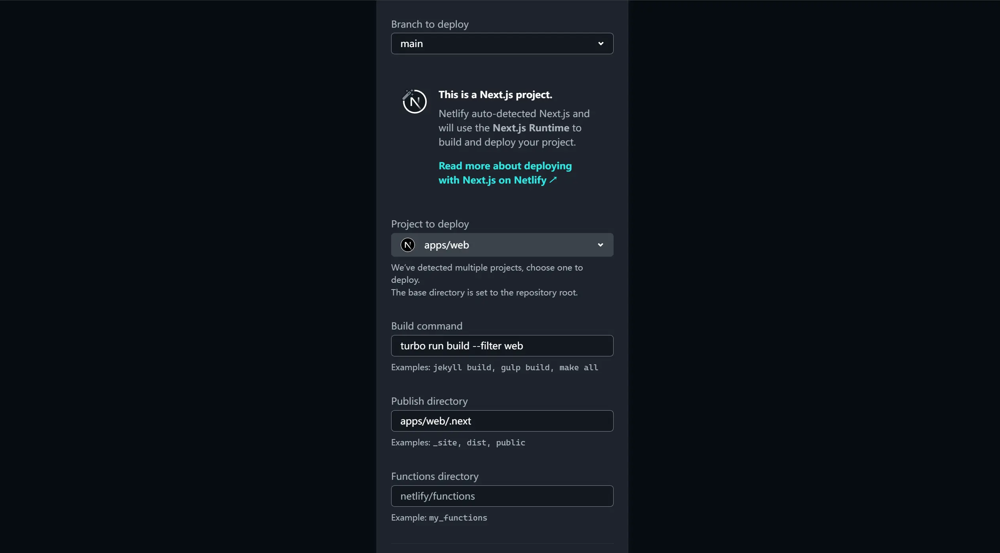

下面我们在 Netlify 上部署 NeutralPress。由于 Netlify 不提供 PostgresSQL 和 Redis 云服务，我们需要先单独获取这些服务。

请先参考 [PostgreSQL 云服务](/docs/deploy/cloud#postgressql-云服务) 和 [Redis 云服务](/docs/deploy/cloud#redis-云服务)页面，先获取 PostgreSQL 和 Redis 的连接字符串，并写在下方：

<ConfigForm label="DATABASE_URL" />
<ConfigForm label="REDIS_URL" />

## 步骤

### Fork 仓库

首先，在 GitHub 上 Fork 项目到自己的账号下。

### 创建项目

前往 [Netlify](https://www.netlify.com/) 并登录/注册你的账号，并绑定你的 GitHub 账号。

### 配置部署设置

按以上照片进行设置：

- Project to deploy: apps/web
- Build command: `turbo run build --filter web`
- Publish directory: `apps/web/.next`

### 配置环境变量

<ConfigForm />

全部复制后，选择“Import from a .env file”，直接粘贴进去即可。然后点击部署。

