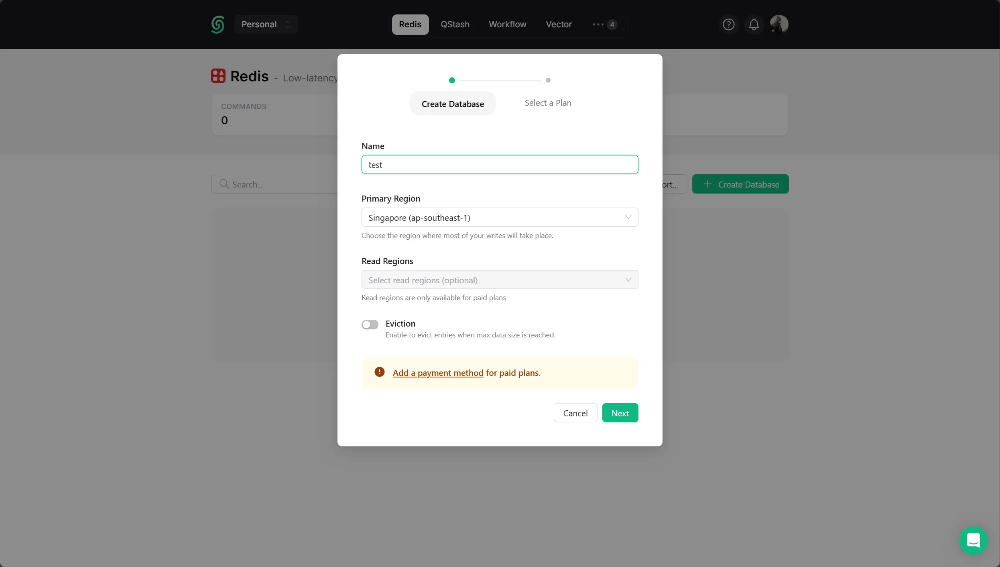
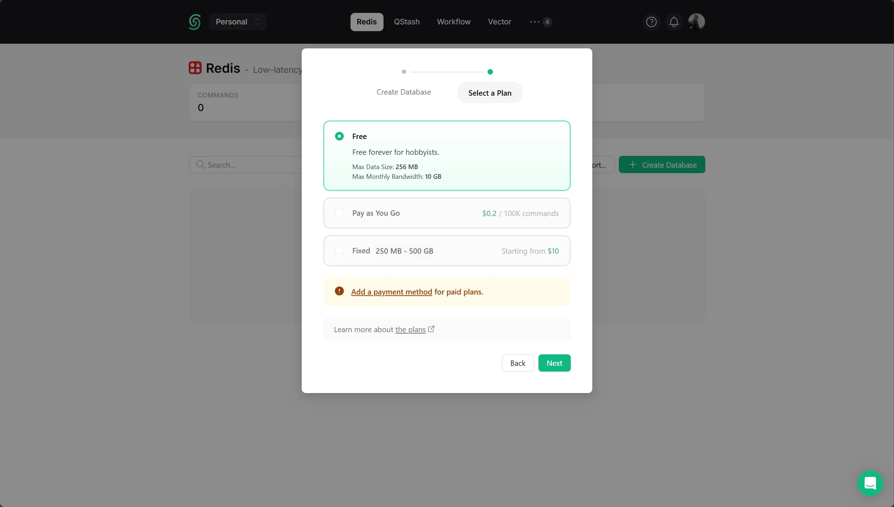
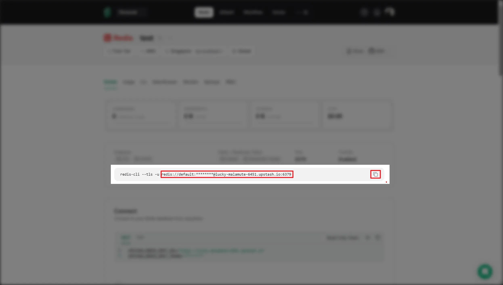

## 步骤

<div className="fd-steps">
<div className="fd-step">

### 注册账号

前往 [Upstash](https://upstash.com/) 并注册一个账号。

</div>
<div className="fd-step">

### 创建数据库



### 获取连接字符串




注意复制之后再截取 redis:// 后面的部分，并且需要把 redis:// 换成 rediss://，最后的连接字符串应该是这样的：

```txt
rediss://:password@host:port
```

</div>
</div>
