## 简介

Vercel 是 Next.js 的官方托管平台，免费套餐额度较多，同时提供 PostgreSQL 和 Redis，是快速开始的最佳选择。

Vercel 的云服务免费提供 `.vercel.app` 的二级域名，但因某种原因导致境内无法访问。绑定自己的域名可解决此问题。

## 步骤

### 登录到 Vercel

访问 [Vercel 官网](https://vercel.com/) 并注册账号，或使用 GitHub / GitLab / Bitbucket 账号登录。此过程可能需要验证手机号。

### 创建项目

有两种方式可以选择：Fork 项目后导入 Vercel ，或者使用 Vercel 的一键创建功能。

其中，更推荐先 Fork 再导入。因为这样后续更新更方便:

1. 首先，在 GitHub 上 Fork 项目到自己的账号下。
   
2. 然后，在 Vercel 上使用 Github 登录。
   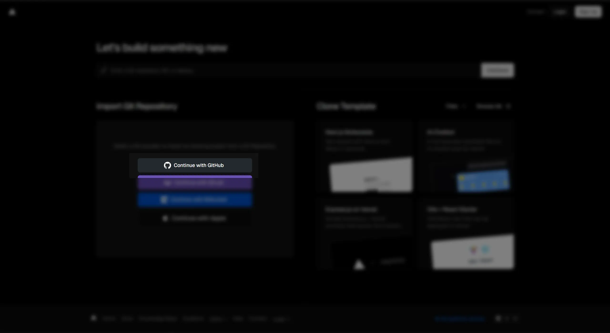
3. 你可能需要安装一个 Vercel 的 GitHub 应用，安装后选择 Fork 的项目。
   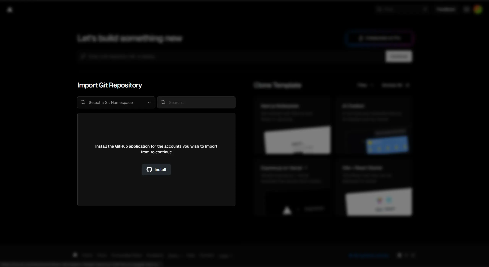
   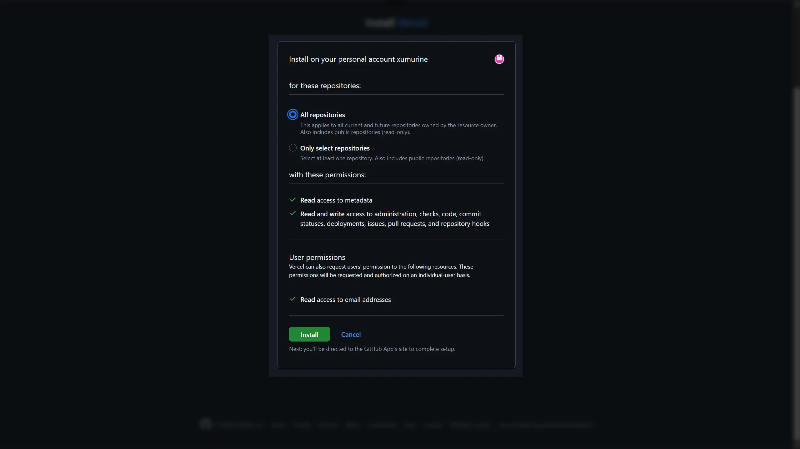
4. 最后，选择 Fork 的项目并导入。
   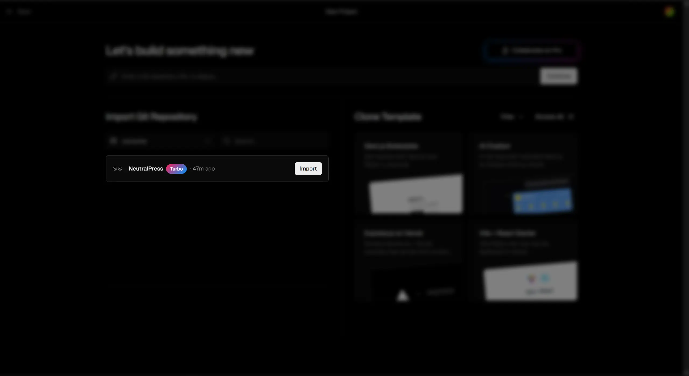

最后，你应该能看到这样的页面：
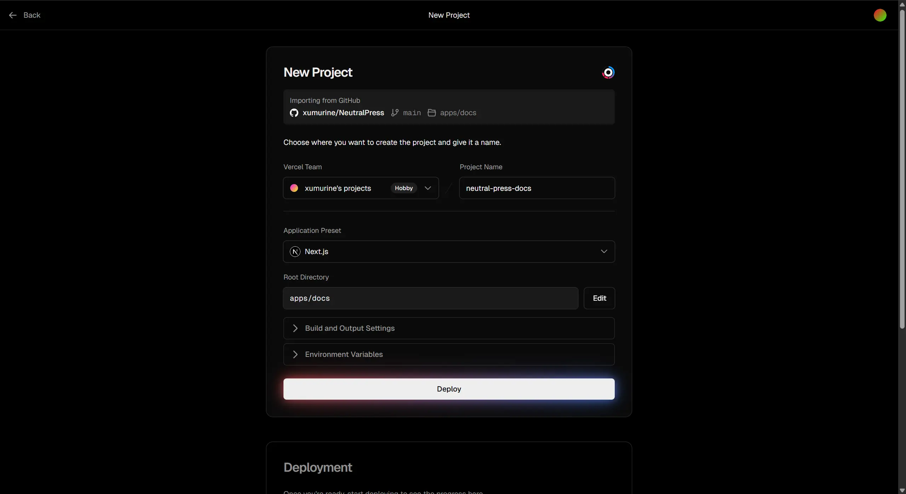

此时，你需要点击“Edit”，将项目切换为 apps/web 目录：
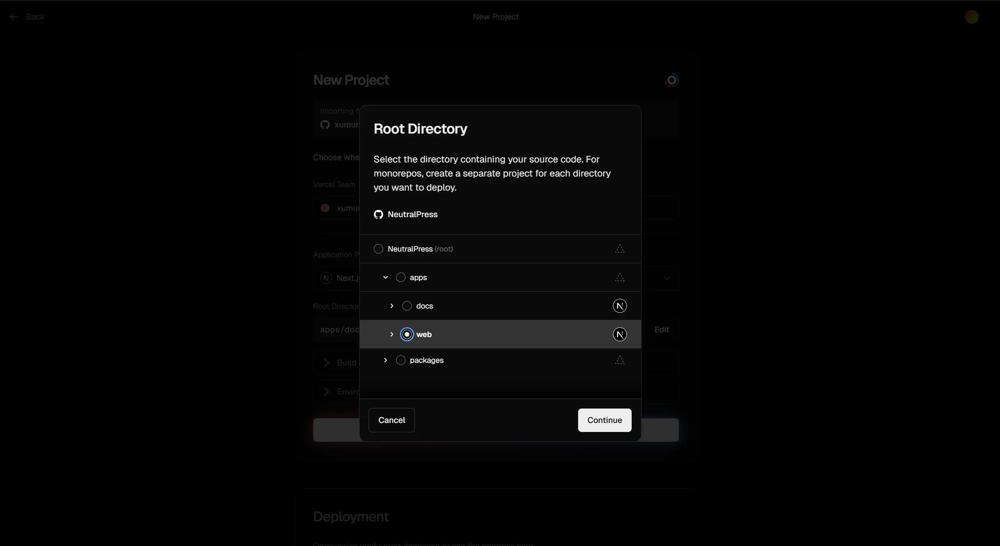

点击“Build and Output Settings”，你应该能看到下面的环境变量设置：
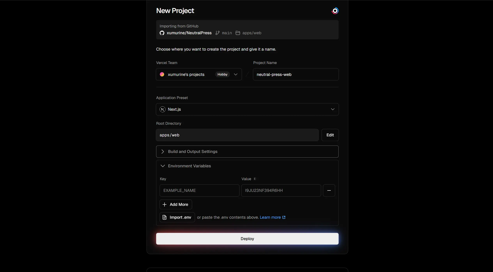

接下来，请转到 [#获取 PostgreSQL](#获取-postgresql) 步骤，配置下面的环境变量部分。

---

或者，你也可以选择一键创建项目，但这样更新更复杂些，需要配置 Github Token。
[](https://vercel.com/new/clone?repository-url=https%3A%2F%2Fgithub.com%2FRavelloH%2FNeutralPress&env=DATABASE_URL,REDIS_URL,MASTER_SECRET,JWT_PRIVATE_KEY,JWT_PUBLIC_KEY,LANG&envDefaults=%7B%22LANG%22%3A%22zh_CN%22%7D&envDescription=%E5%8F%82%E8%80%83%20Vercel%20%E9%83%A8%E7%BD%B2%E6%96%87%E6%A1%A3%EF%BC%9A&envLink=https%3A%2F%2Fneutralpress.net%2Fdocs%2Fdeploy%2Fcloud%2Fvercel&project-name=neutralpress&repository-name=neutralpress&demo-title=Demo%3A%20RavelloH's%20Blog&demo-description=%E5%BC%80%E5%8F%91%E8%80%85%E8%87%AA%E5%B7%B1%E7%9A%84%20NeutralPress%20%E5%AE%9E%E4%BE%8B&demo-url=https%3A%2F%2Fravelloh.com&demo-image=https%3A%2F%2Fneutralpress.net%2Frepo%2Ffront%2Ffront-1.webp)

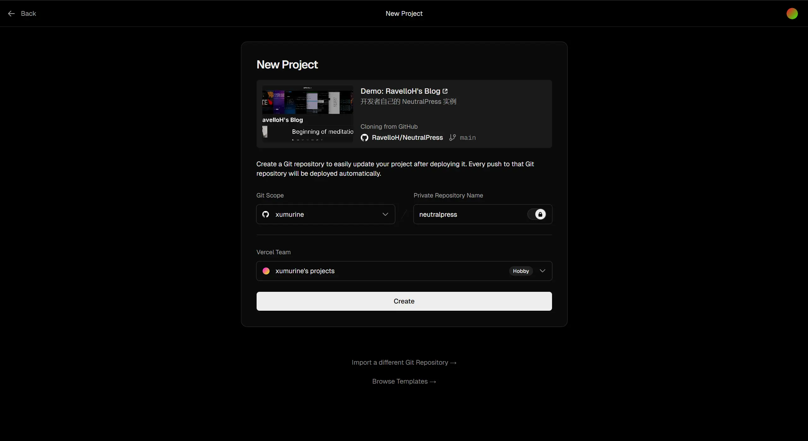

然后，你应该能看到下方的环境变量设置：
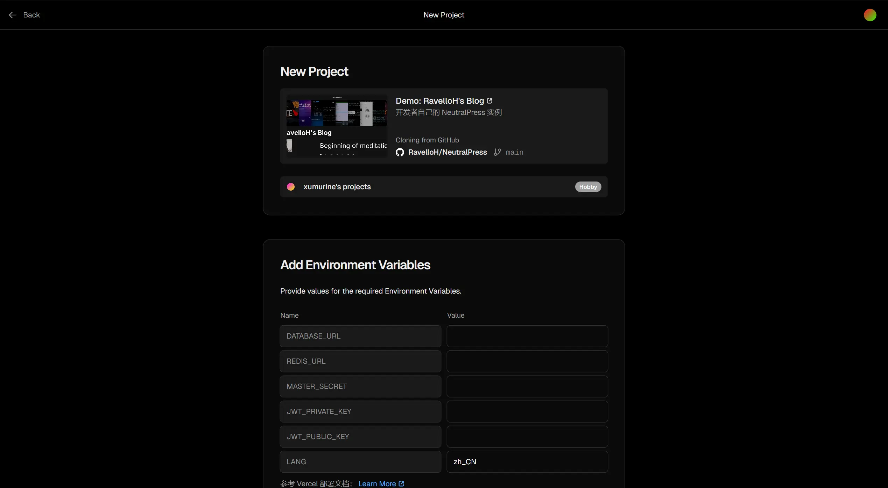

接下来，请转到 [#获取 PostgreSQL](#获取-postgresql) 步骤，配置下面的环境变量部分。

### 获取 PostgreSQL

然后，不要关闭当前这个页面，点击此处新打开一个 Vercel 标签页：[Vercel](https://vercel.com/)。

在左侧菜单中选择“Storage”，找到 Neon 的 PostgreSQL 并Create：

1. 安装 PostgreSQL:
   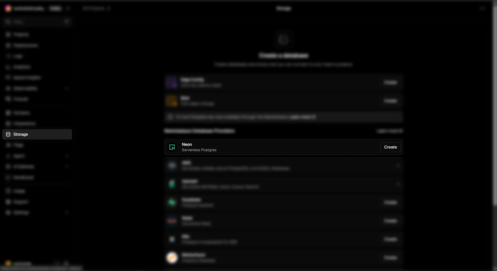

2. 同意权限
   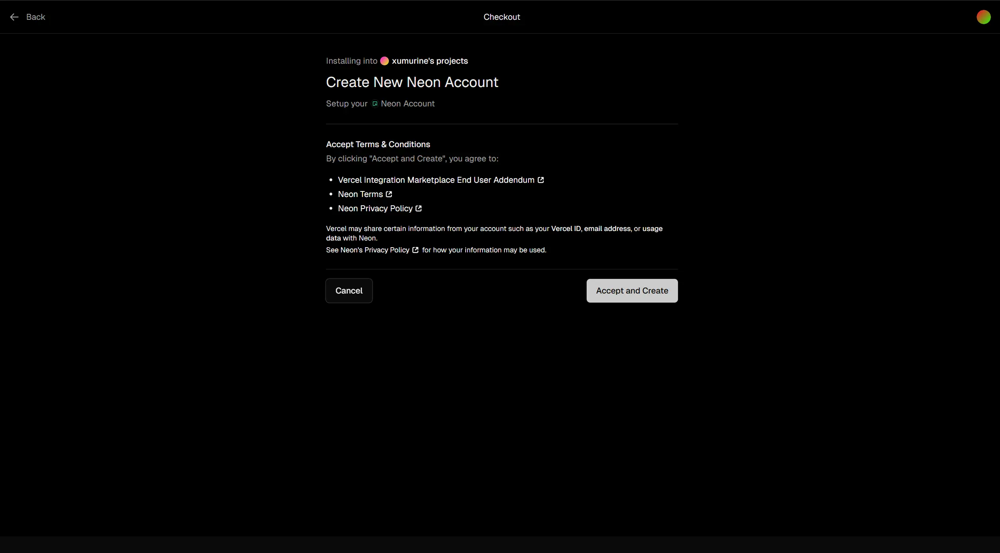

3. 创建数据库。这里的地区可以选离你近一些的。如果你更改了地区，记得记住这个地区，我们稍后会调整函数的部署地区，使其响应更快。
   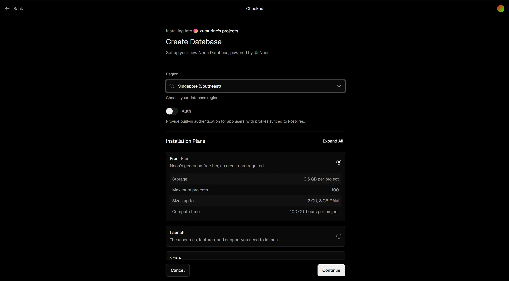

4. 创建完成后是这样的。之后，点击 Done，进入数据库详情页面
   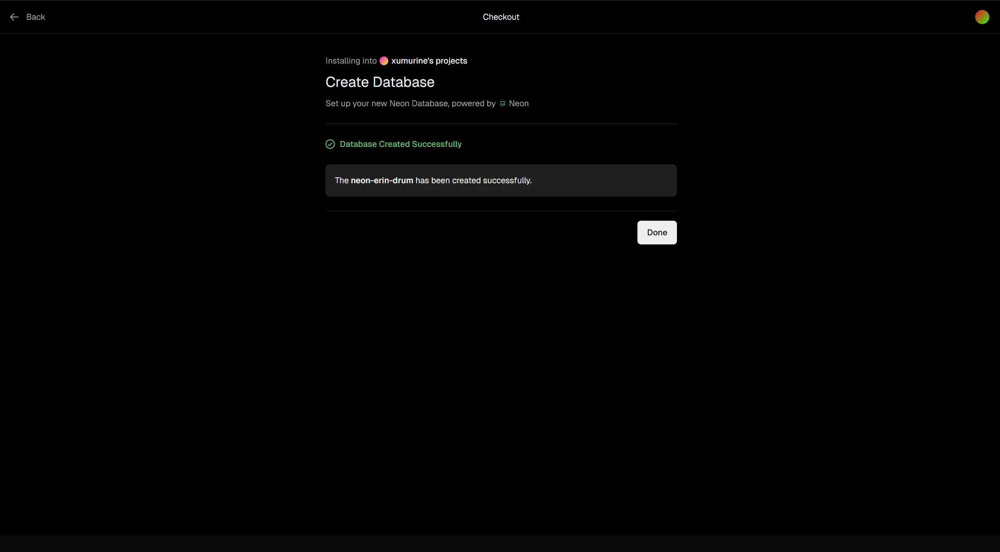

5. 点击 “Show Secret”，复制下方的 `DATABASE_URL`，粘贴到下方输入框：
   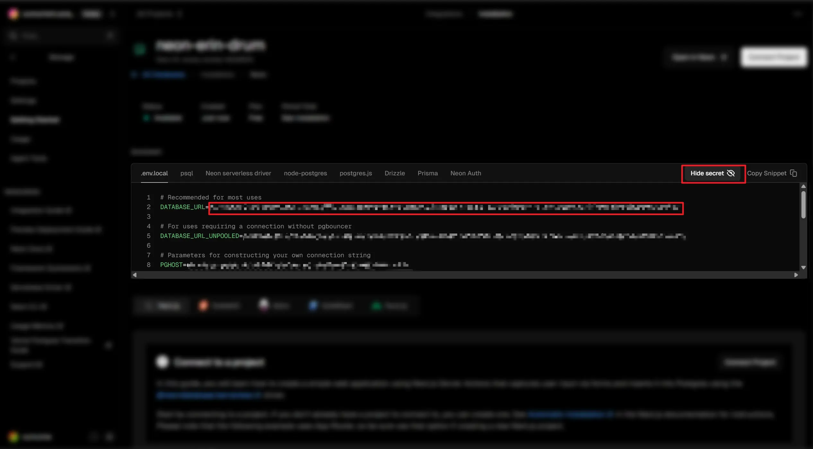

<ConfigForm label="DATABASE_URL" />

### 获取 Redis

1. 回到 Vercel 的 Storage 页面，点击 Create Database。
   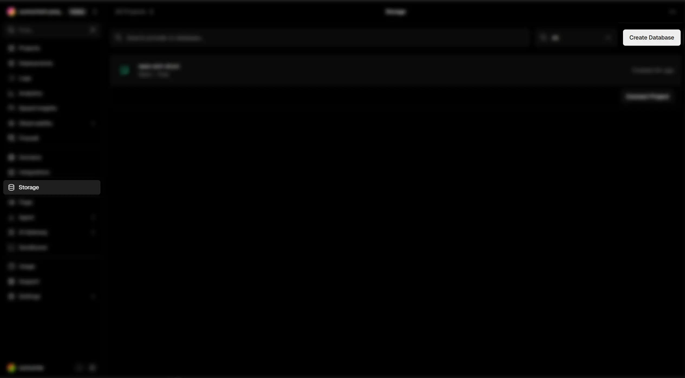

2. 选择“Redis - Serverless Redis”，同意权限并创建。
   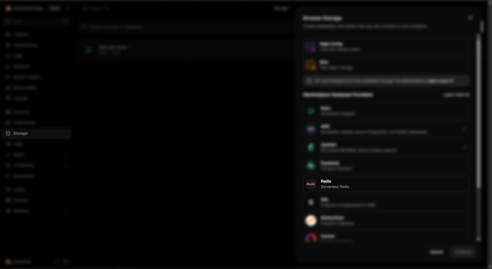

3. 同样选择一个地区，并创建那个免费的计划：
   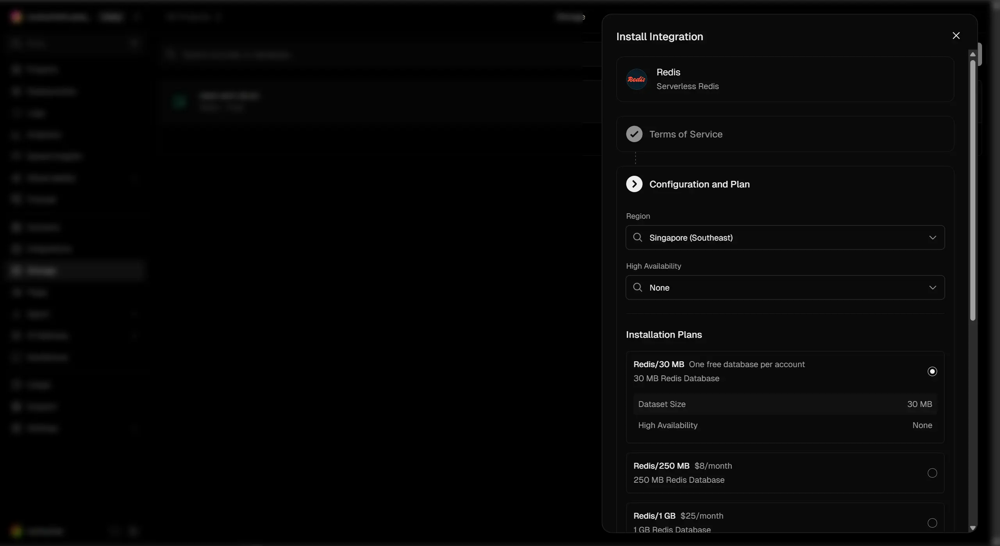

4. 创建完成后，点击 Done，进入 Redis 详情页面，点击 “Show Secret”，复制下方的 `REDIS_URL`，（刚打开的时候，可能会显示“database_provisioning_in_progress”，这个时候刷新一下就行）粘贴到下方输入框：
   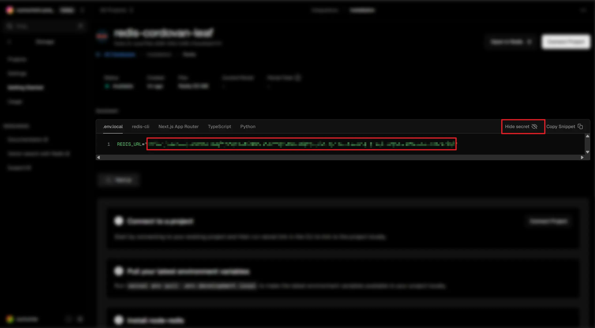

<ConfigForm label="REDIS_URL" />

### 导入配置

填写下面的表单以生成所需的环境变量。你在上面的步骤中，应该已经填写了 PostgreSQL 和 Redis 的连接字符串。其余字段不填则自动生成。

<ConfigForm />

复制上面的字段，粘贴到 Vercel 的环境变量设置中（可全部复制后一键粘贴），保存后点击 Deploy。稍等5分钟，你的 CMS 就可以访问了。

### 优化配置

默认情况下，Vercel 会将函数部署在美国，这可能会导致国内访问较慢。你可以将函数部署在离你近的地区，以提升访问速度。注意需要让 PostgreSQL 、Redis 和函数处在同一地区，建议选择 Singapore 或者 Tokyo。

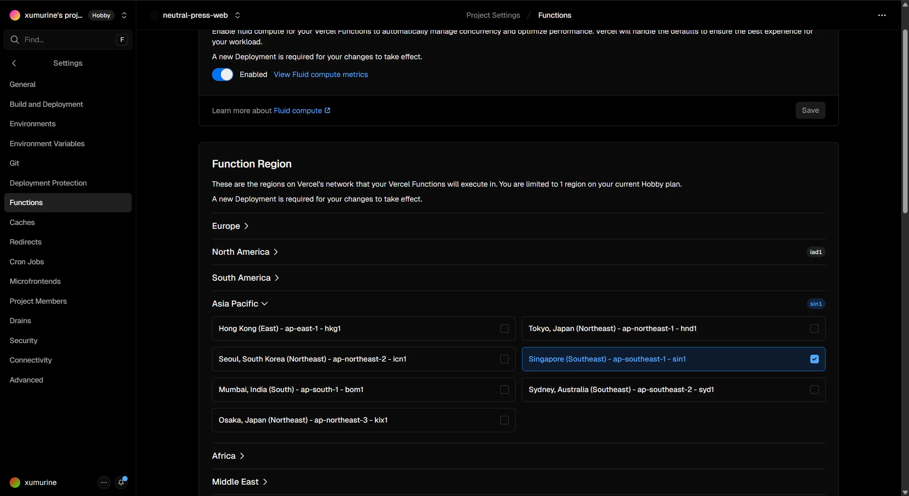

在项目设置的 “Functions” 中，找到“Regions”，选择你之前创建数据库时选的地区，保存后重新部署即可。

重新部署项目的方式是，在项目首页点击“Deployments”，找到最新的部署，点击右侧的“Redeploy”按钮即可。

