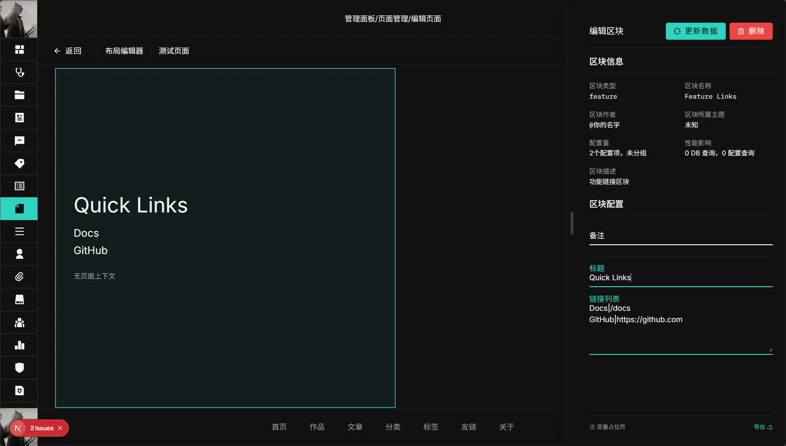
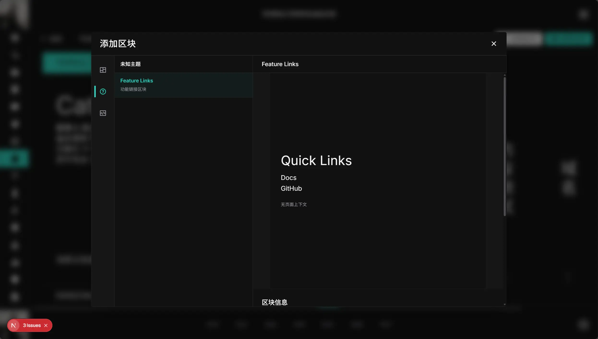

在这一章节，我们将一步步创建一个名为 `feature` 的区块。



## 目标

创建一个名为 `feature` 的区块，实现：

1. 编辑器可配置标题和链接列表。
2. 服务端可根据路由上下文补充一段动态信息。
3. 前台与编辑器预览都能渲染一致结果。

<div class="fd-steps">
<div class="fd-step">

## 步骤 1：创建目录

在 `apps/web/src/blocks/collection` 下新建目录，包含这五个文件：

```text
Feature/
  definition.ts
  schema.ts
  types.ts
  fetcher.ts
  index.tsx
```

</div>
<div class="fd-step">

## 步骤 2：写类型

编辑 `types.ts` ，这里我们希望区块内容包含 `title` 和 `links`，运行时数据包含 `links` 和 `note`。

```ts
import type { BaseBlockConfig } from "@/blocks/core/types/base";

export interface FeatureContent {
  title?: string;
  links?: string[];
}

export interface FeatureLink {
  label: string;
  href: string;
}

export interface FeatureData {
  links: FeatureLink[];
  note?: string;
}

export interface FeatureBlockConfig extends BaseBlockConfig {
  block: "feature";
  content: FeatureContent;
}
```

</div>
<div class="fd-step">

## 步骤 3：写编辑器 schema

编辑 `schema.ts`，定义用户可以更改哪些设置。

```ts
import type { BlockFormConfig } from "@/blocks/core/types/field-config";

export const FEATURE_BLOCK_FORM_CONFIG: BlockFormConfig = {
  // 区块的基本信息
  blockType: "feature",
  displayName: "Feature Links",
  description: "功能链接区块",
  author: { name: "你的名字", url: "https://your-website.com" },
  // 下面指定两个可配置字段
  fields: [
    {
      label: "标题",
      path: "title",
      type: "text",
      placeholder: "请输入标题",
    },
    {
      label: "链接列表",
      path: "links",
      type: "array",
      placeholder: "每项格式：名称|链接，例如 GitHub|https://github.com",
    },
  ],
  // 下面是在编辑器预览的时候显示的内容
  previewData: {
    title: "Quick Links",
    links: ["Docs|/docs", "GitHub|https://github.com"],
  },
};
```

schema 的详细写法见：[Schema API](/docs/dev/blocks/schema-api)

</div>
<div class="fd-step">

## 步骤 4：写业务 fetcher

编辑 `fetcher.ts`，负责在运行时获取数据。

这里我们把编辑器输入的字符串数组解析成结构化数据，并根据上下文补充一段说明文字。

```ts
import type {
  FeatureContent,
  FeatureData,
} from "@/blocks/collection/Feature/types";
import type { RuntimeBlockInput } from "@/blocks/core/definition";

export async function featureBlockFetcher(
  config: RuntimeBlockInput,
): Promise<FeatureData> {
  const content = (config.content || {}) as FeatureContent;
  const context = (config.data || {}) as Record<string, unknown>;
  const links = (content.links || [])
    .map((item) => String(item).trim())
    .filter(Boolean)
    .map((line) => {
      const [label, href] = line.split("|").map((part) => part.trim());
      return {
        label: label || href || "未命名链接",
        href: href || "#",
      };
    });

  return {
    links,
    note: context.url ? `当前页面: ${String(context.url)}` : "在编辑器内",
  };
}
```

要求：

1. 主导出名必须是 `*Fetcher`。
2. 一个 `fetcher.ts` 只保留一个主 `*Fetcher` 导出（自动发现依赖这个约束）。
3. 建议把编辑器输入的字符串数组在 `fetcher.ts` 内解析成结构化数据。

</div>
<div class="fd-step">

## 步骤 5：写组件

编辑 `index.tsx`，负责渲染 UI。

```tsx
import type {
  FeatureBlockConfig,
  FeatureData,
} from "@/blocks/collection/Feature/types";
import type { BlockComponentProps } from "@/blocks/core/definition";
import { getBlockRuntimeData } from "@/blocks/core/runtime/envelope";
import RowGrid, { GridItem } from "@/components/client/layout/RowGrid";

export default function FeatureBlock({ block }: BlockComponentProps) {
  const content = (block.content || {}) as FeatureBlockConfig["content"];
  const data = getBlockRuntimeData<FeatureData>(block.runtime);

  return (
    <RowGrid>
      <GridItem
        areas={[1, 2, 3, 4, 5, 6, 7, 8, 9, 10, 11, 12]} // 在桌面端，占满 12 行
        width={1} // 宽是高度的 1 倍
        className="px-10 py-15 flex flex-col justify-center"
      >
        <h3 className="text-5xl mb-6">{content.title || "Feature"}</h3>
        <ul className="text-2xl space-y-2">
          {data.links.map((link) => (
            <li key={`${link.label}-${link.href}`}>
              <a href={link.href}>{link.label}</a>
            </li>
          ))}
        </ul>
        {data.note ? (
          <p className="mt-8 text-muted-foreground">{data.note}</p>
        ) : null}
      </GridItem>
    </RowGrid>
  );
}
```

说明：

1. 区块组件请统一用 `RowGrid + GridItem` 做布局编排。
2. `areas` 是桌面端 12 行分区；移动端可通过 `mobileAreas` 与 `mobileIndex` 调整。
3. `RowGrid` 详解见：[UI 布局与 RowGrid](./ui-rowgrid)

</div>
<div class="fd-step">

## 步骤 6：写 definition

编辑 `definition.ts`，负责区块的元信息与加载逻辑。

```ts
import { createBlockDefinition } from "@/blocks/core/definition";

export const featureBlockDefinition = createBlockDefinition({
  // 区块类型标识符
  type: "feature",
  // 动态 schema 与组件
  schema: () =>
    import("./schema").then(
      (schemaModule) => schemaModule.FEATURE_BLOCK_FORM_CONFIG,
    ),
  component: () =>
    import("./index").then((componentModule) => componentModule.default),
  // 业务逻辑能力
  capabilities: {
    context: "inherit",
    placeholders: {
      enabled: true,
      source: "content",
      withContext: true,
    },
    media: [],
  },
});
```

重点：

1. `definition.ts` 不要导入 `fetcher.ts`（否则会引入客户端 `server-only` 问题）。

</div>
<div class="fd-step">

## 步骤 7：让系统发现新区块

1. 确保目录是 `apps/web/src/blocks/collection/Feature`。
2. 运行：

```bash
pnpm --filter web generate:blocks
# 或者运行整个预构建流程，此流程会在构建之前自动运行
pnpm --filter web build:pre
```

该命令会自动生成：

1. `apps/web/src/blocks/core/generated/block-definitions.ts`（客户端 definition 列表）
2. `apps/web/src/blocks/core/generated/business-fetcher-catalog.ts`（服务端 fetcher 映射）

</div>
<div class="fd-step">

## 步骤 8：检查质量

在仓库根目录执行：

```bash
pnpm check-types
pnpm lint
```

如果都通过，你的区块已经进入可用状态。打开区块编辑器，就能看到刚才创建的 `Feature Links` 区块。



</div>
</div>
