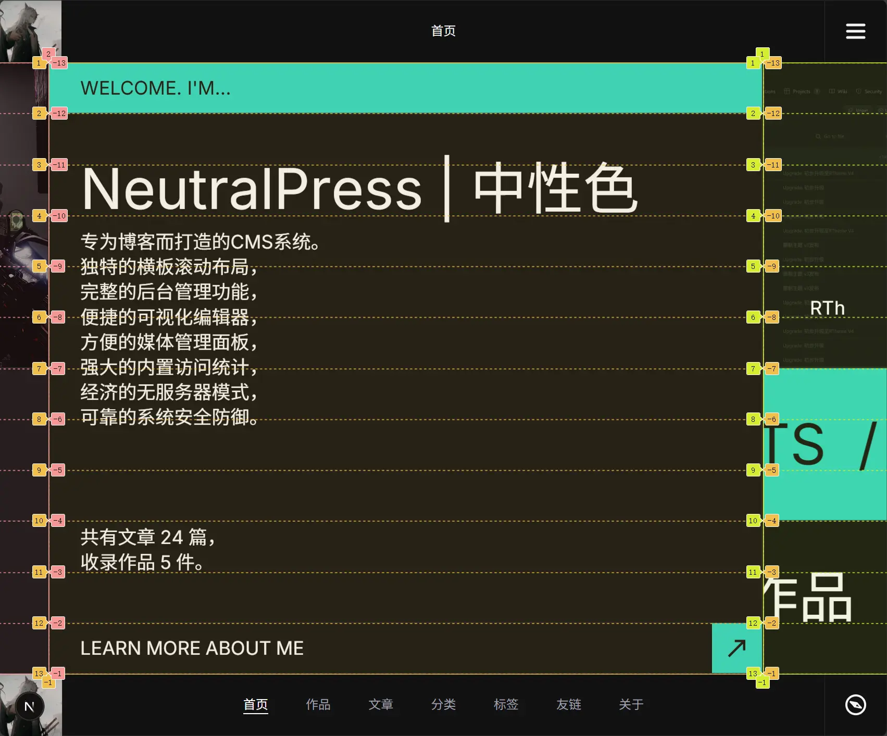

区块组件开发时，布局层请统一使用 `RowGrid + GridItem`作为外层包装。  
源码位置：`apps/web/src/components/client/layout/RowGrid.tsx`

这个组件能自动适应桌面端与移动端，必须使用这个组件才能确保在双端显示正常。

否则你懂的，NeutralPress 是横向滚动的，与传统的网页布局完全不同。设想一下：

- 你打算在移动端创建一个宽度 100% 的组件，但桌面端横向无限制，到了桌面端变成了无限宽度。
- 你打算在桌面端创建一个高度 100% 的组件，但移动端纵向无限制，到了移动端变成了无限高度。

这个组件的设计目标是：

1. 保持桌面/移动端的行为一致。
2. 让所有区块共享同一套 12 分区心智模型。
3. 降低后续维护成本，避免每个区块各写一套布局规则。

## 1. 心智模型

### 桌面端



1. `RowGrid` 使用 `grid-rows-12` + 横向流布局。
2. `GridItem.areas` 表示占用第几行（`1..12`）。
3. `width` 决定“宽高比例”，最终宽度由容器高度推导。

### 移动端


1. `RowGrid` 切换为 `grid-cols-12` + 纵向流布局。
2. `GridItem.mobileAreas` 表示占用第几列（不传则默认 `1..12`，即整行）。
3. `mobileIndex` 可指定移动端显示顺序（`order-*`）。

## 2. 基础用法

```tsx
import RowGrid, { GridItem } from "@/components/client/layout/RowGrid";

export default function DemoBlock() {
  return (
    <RowGrid>
      <GridItem areas={[1, 2, 3, 4, 5, 6]} width={2} className="p-10">
        左侧内容
      </GridItem>

      <GridItem
        areas={[7, 8, 9, 10, 11, 12]}
        mobileAreas={[1, 2, 3, 4, 5, 6]}
        width={2}
        mobileIndex={1}
        className="p-10"
      >
        右侧内容
      </GridItem>
    </RowGrid>
  );
}
```

## 3. API 说明

### `RowGrid` Props

1. `className?: string`  
   传递容器样式。

2. `full?: boolean`  
   桌面端启用“按比例填满宽度”模式（内部使用 `flex-grow` 分配）。  
   区块开发通常保持默认 `false`，特殊全屏编辑视图才使用 `true`。

3. `style?: CSSProperties`  
   常用于动态 `gap` 等布局参数。

4. `id?: string`  
   容器标识。

### `GridItem` Props

1. `areas: GridArea[]`（必填）  
   桌面端占用的行区域，取值范围 `1..12`。

2. `width?: number`（默认 `3.2`）  
   桌面端宽度比例参数。  
   近似计算：`itemWidth = (containerHeight / 12 * areas.length) * width`。

3. `mobileAreas?: GridArea[]`  
   移动端占用列区域；不传时默认整行。

4. `height?: number`  
   移动端高度比例参数，默认 `1 / width`，以保持相同的宽高比例关系。只决定最小高度，如果内容超出会撑开。

5. `fixedHeight?: boolean`  
   `true`：移动端使用固定 `height`。  
   `false`：移动端使用 `min-height`，内容可撑开。

6. `mobileIndex?: number`  
   移动端顺序（`order-*`），用于“桌面横排、移动重排”。

7. `className?: string`  
   条目样式类名。

## 4. 常见布局模式

### 模式 A：头-主体-底部

```tsx
<RowGrid>
  <GridItem areas={[1]} width={12} height={0.1}>
    Header
  </GridItem>
  <GridItem areas={[2, 3, 4, 5, 6, 7, 8, 9, 10, 11]} width={1.2}>
    Body
  </GridItem>
  <GridItem areas={[12]} width={12} height={0.1}>
    Footer
  </GridItem>
</RowGrid>
```

### 模式 B：桌面上下双行、移动左右双列

```tsx
<RowGrid>
  <GridItem
    areas={[1, 2, 3, 4, 5, 6]}
    mobileAreas={[1, 2, 3, 4, 5, 6]}
    width={2}
    mobileIndex={0}
  >
    A
  </GridItem>
  <GridItem
    areas={[7, 8, 9, 10, 11, 12]}
    mobileAreas={[7, 8, 9, 10, 11, 12]}
    width={2}
    mobileIndex={1}
  >
    B
  </GridItem>
</RowGrid>
```

## 5. 开发建议

1. 先画出 `areas` 分区，再写业务内容，避免一边写 UI 一边改布局。
2. 同一行高占比的卡片，优先统一 `areas.length`，便于视觉节奏稳定。
3. 图片/轮播块常配合 `fixedHeight`，文本块通常使用非固定高度。
4. 需要动画时，把动画属性挂在 `GridItem` 子节点，不要修改 `RowGrid` 核心结构。

## 6. 常见错误

1. 直接用普通 `div` 取代 `RowGrid`，导致移动端/桌面行为漂移。
2. `areas` 超出 `1..12`，或分区重叠混乱，导致排版异常。
3. 忽略 `mobileAreas/mobileIndex`，桌面可读但移动端顺序错乱。
4. 把业务数据处理写进布局组件；布局组件只负责结构编排。

## 7. 与区块协议的关系

推荐组合是：

1. `definition.ts` 声明能力。
2. `fetcher.ts` 产出 `runtime.business`。
3. `index.tsx` 用 `RowGrid` 编排结构，用 `block.content + block.runtime` 渲染内容。

如果你新增区块并遵守这套模式，前台与编辑器渲染会更稳定，后续维护成本最低。
