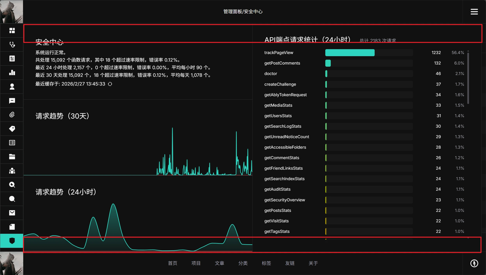

## 安全区滚动

NeutralPress 采用横向滚动作为页面主导航方式。为解决横向滚动容器与内部可垂直滚动子元素之间的滚轮事件冲突，框架实现了"安全区"机制。

在每个横向滚动区域中，**顶部和底部各 1/12 的高度范围被划定为安全区**。在安全区内滚动，事件将直接传递给父容器，触发横向翻页；在安全区以外的中间区域滚动，则由当前子元素正常处理垂直滚动。

此机制作用于所有横向滚动区域，与该区域内是否存在可垂直滚动的子元素无关，确保用户在页面任意位置都能可靠地触发横向翻页。

