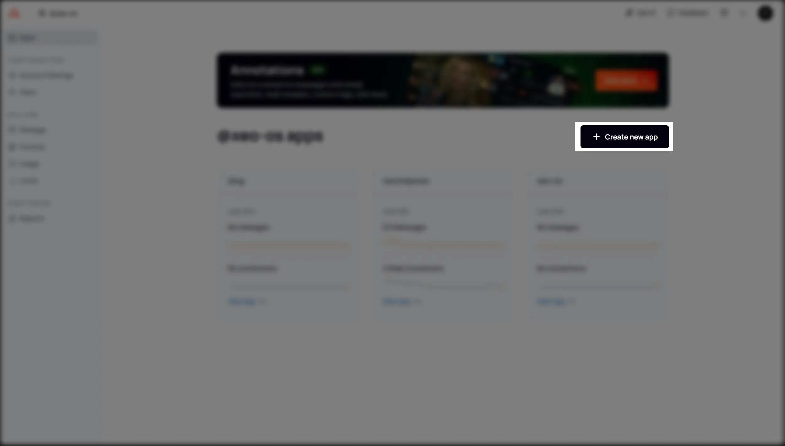
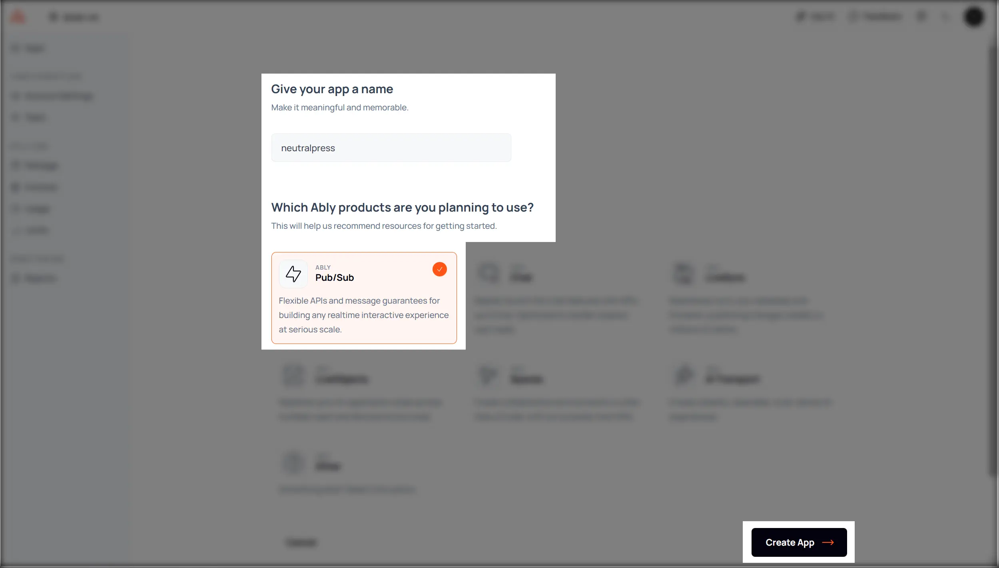

## 介绍

NeutralPress 运行在 Serverless 环境中，无法靠自身维持 WebSocket 连接以实现实时通信功能。因此，NeutralPress 集成了 [Ably](https://ably.com/) 实时通信服务，作为 WebSocket 连接的中介，确保实时功能的正常运行。

## 配置

### 1. 前往 [Ably 首页](https://ably.com/)

注册账户后，打开仪表盘，创建一个新项目。

### 2. 填写相关信息

按照图片中的选择即可。

### 3. 获取 API Key

注意选那个`root`的key。

### 4. 在 NeutralPress 中配置 Ably

在 NeutralPress 的管理面板中打开设置页面，然后选择“通知策略”标签页，并填写 `notice.ably.key` 的配置值字段。

保存后，实时通信功能将即刻生效。

