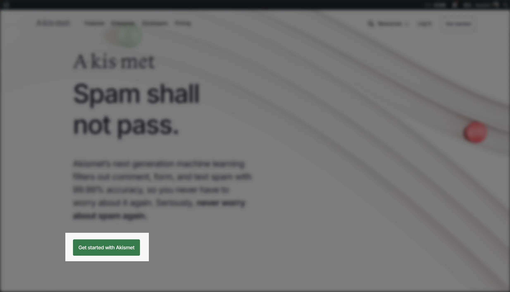
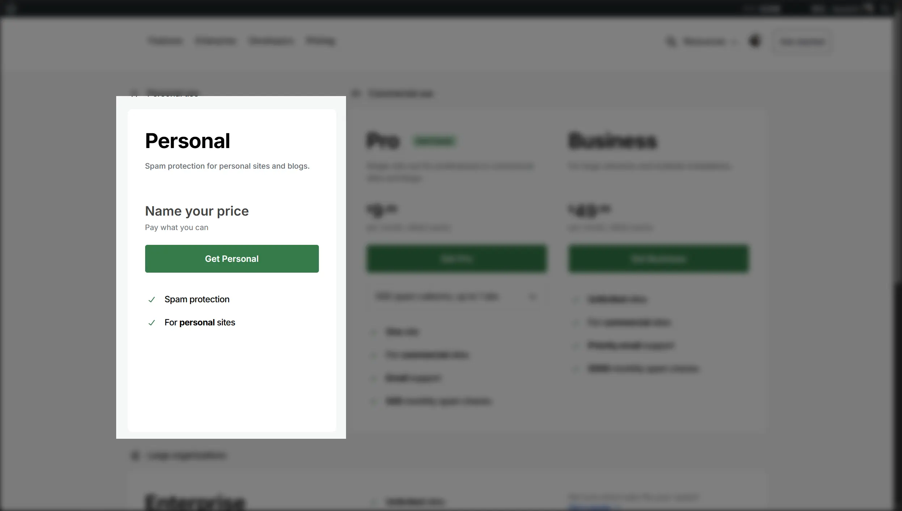
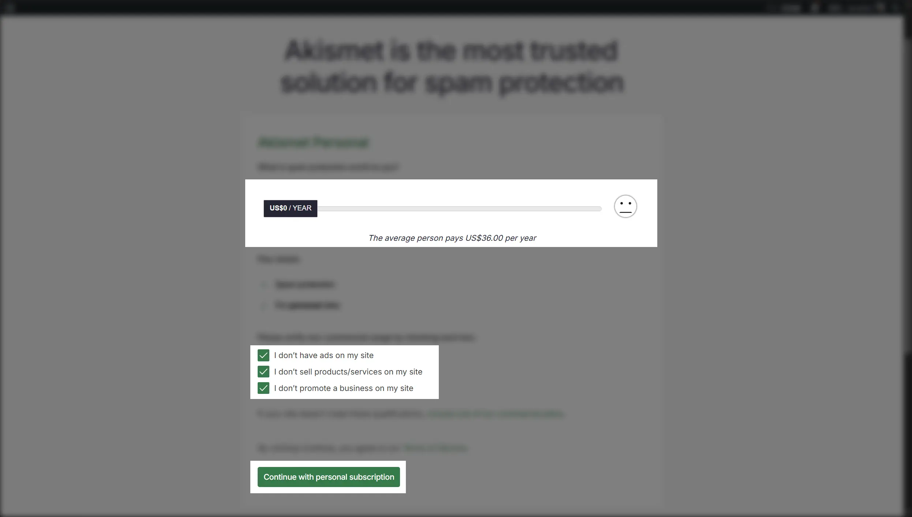
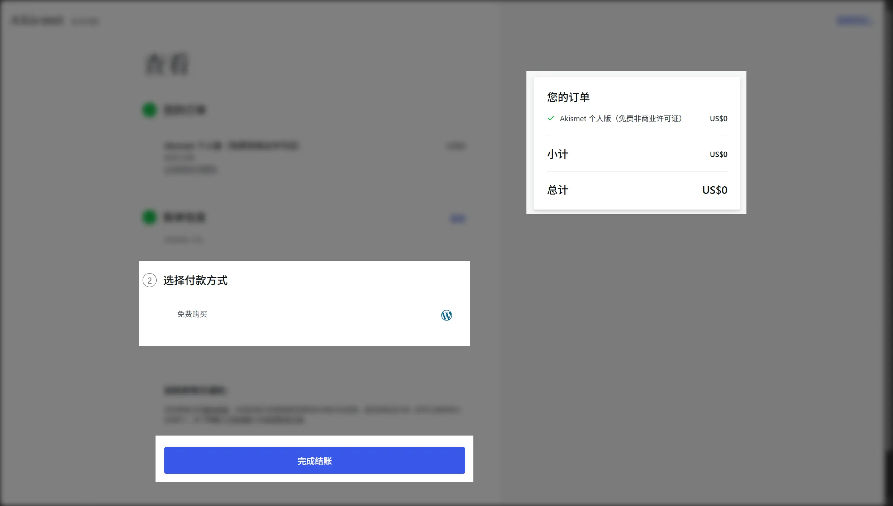
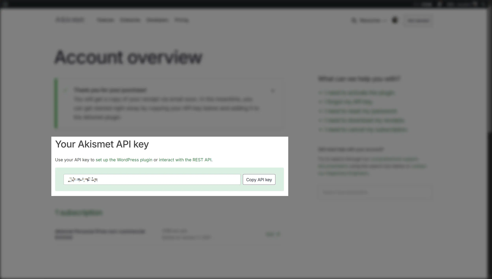

## 介绍

[Akismet](https://akismet.com/) 是一个流行的评论反垃圾服务，由 WordPress 的创始人 Matt Mullenweg 创建。它通过分析评论内容和行为，帮助网站管理员识别和过滤垃圾评论，从而保持评论区的质量和健康。

它采用“Pay as you go” 计费模式，对于个人和非商业网站，Akismet 提供免费的 API Key。

NeutralPress 集成了 Akismet 服务，允许你轻松启用评论反垃圾功能，提升你的网站评论体验。

## 策略

- 需要在设置中配置 `comment.akismet.enable` 和 `comment.akismet.apiKey` 选项以启用 Akismet 服务。
- 不会对 AUTHOR/EDITOR/ADMIN 进行检查，这些管理角色的评论直接豁免。
- 在反垃圾开启的状态下：
  - 如果启用了人工审核，检测为垃圾评论的评论会被标记为SPAM，正常评论标记为PENDING，等待审核。
  - 如果禁用了人工审核，检测为垃圾评论的评论会被标记为SPAM，正常评论标记为APPROVED，直接通过。
- 在管理员手动标记评论时，会学习管理员的标记，提高检测准确性。

## 配置步骤

### 1. 前往 [Akismet 首页](https://akismet.com/)

这需要你注册一个账户。

### 2. 选择 Personal 计划

### 3. 调整滑块至 0

### 4. 完成结账

（不需要支付方式）

### 5. 获取 API Key

### 6. 在 NeutralPress 中配置 Akismet

在 NeutralPress 的管理面板中打开设置页面，然后选择“评论策略”标签页，将 `comment.akismet.enable` 选项开启，并填写 `comment.akismet.apiKey` 的配置值字段。

保存后，反垃圾功能将即刻生效。

