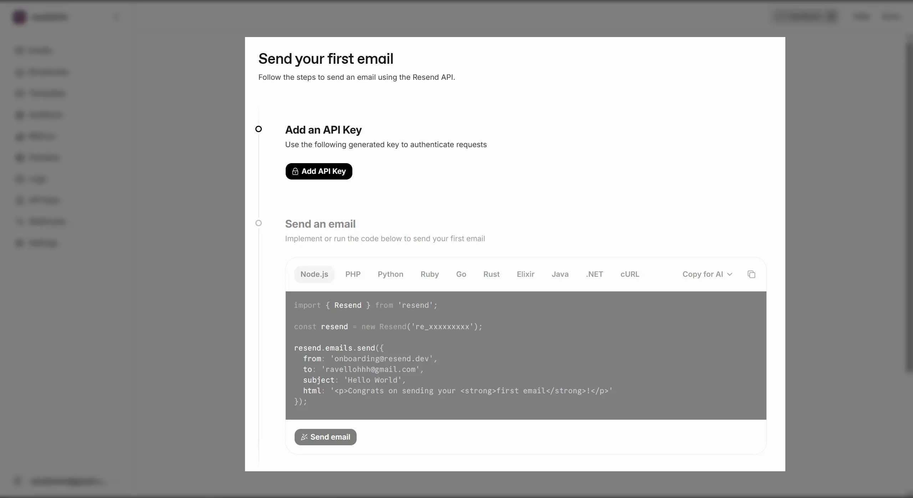
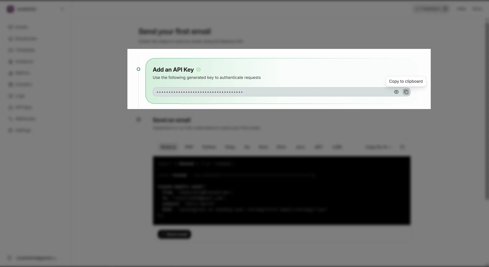
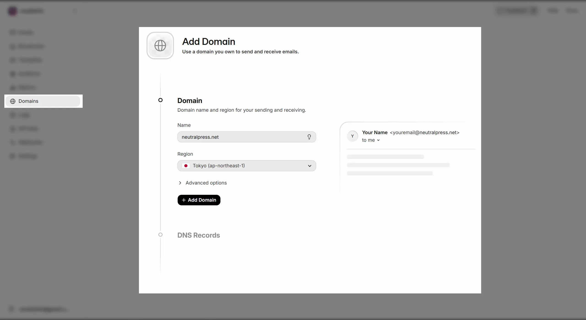

## 介绍

[Resend](https://resend.com/) 是一个专注于开发者体验的邮件发送服务，提供简单易用的 API 和高送达率，适合使用自定义域名发送邮件的用户。

其具有每日100封免费额度，适合中小型网站使用。

## 配置

### 1. 注册账户

前往 [Resend 注册页面](https://resend.com/signup) 创建一个账户。

然后，你应该会看到这个页面：

### 2. 创建 API Key

点击 Add API Key 按钮，创建一个新的 API Key。

### 3. 配置邮箱域名

点击左侧的 Domains 菜单，添加并验证你的邮箱域名。

然后，按指印修改你的域名DNS记录，完成验证。

### 4. 在 NeutralPress 中配置 Resend

在 NeutralPress 的管理面板中打开设置页面，然后选择“通知策略”标签页，并填写 `notice.email.resend.apiKey` 的配置值字段。

你还需要填写 `notice.email` 、`notice.email.from.name`。

保存后，邮件发送功能将即刻生效。

