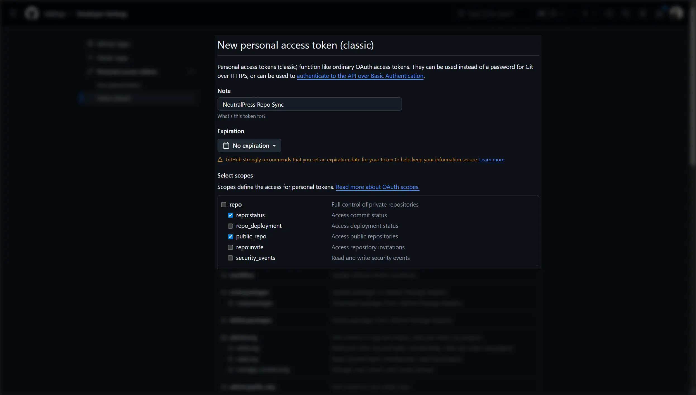
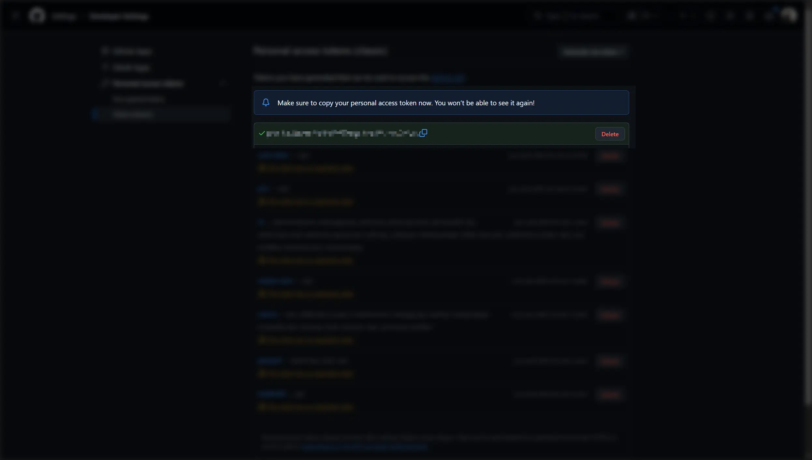

## 介绍

NeutralPress 支持将站点的 Github 仓库信息（如 star 数、fork 数等）同步到站点前端展示，提升站点的社交证明和可信度。
在你日常使用 NeutralPress 的时候，会定期在后台抓取你配置的 Github 仓库信息，并缓存在数据库中。

然而，由于 Github API 的访问限制，频繁的抓取请求可能会导致 API 访问受限，从而影响数据的同步和展示效果。
为了解决这个问题，NeutralPress 提供了通过 Github 个人访问令牌（Personal Access Token, PAT）进行身份验证的选项。使用 PAT 可以显著提高 API 访问的配额，确保数据能够及时同步和更新。

## 步骤

### 1. 前往 [Github 个人访问令牌](https://github.com/settings/tokens)

然后，点击右上角，选择 **Generate new token (classic)**。

### 2. 配置权限范围

NeutralPress 只需要读取公开仓库的信息，因此只需勾选 `repo` 下的 `public_repo` 和 `status` 权限即可。

令牌的有效期可以根据需要选择，建议选择较长的有效期以减少频繁更新令牌的麻烦。

### 3. 复制令牌

### 4. 在 NeutralPress 中配置 Github 个人访问令牌

在 NeutralPress 的管理面板中打开设置页面，然后选择“内容策略”标签页，填写 `content.githubAutoSync.personalKey` 的配置值字段。

保存后，更新数据时就会使用此令牌。

