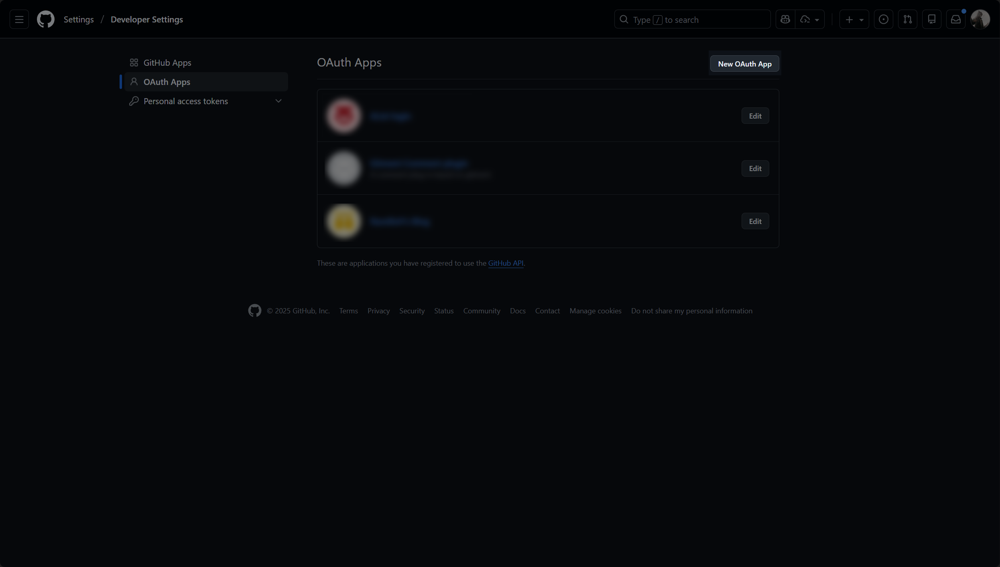
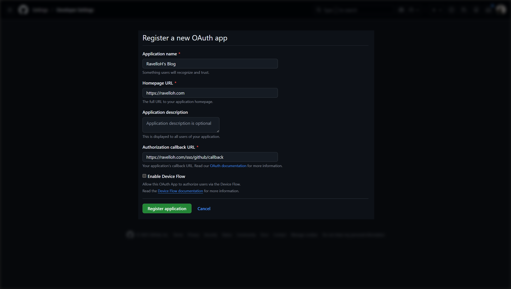
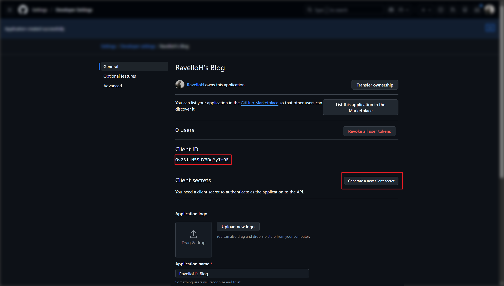
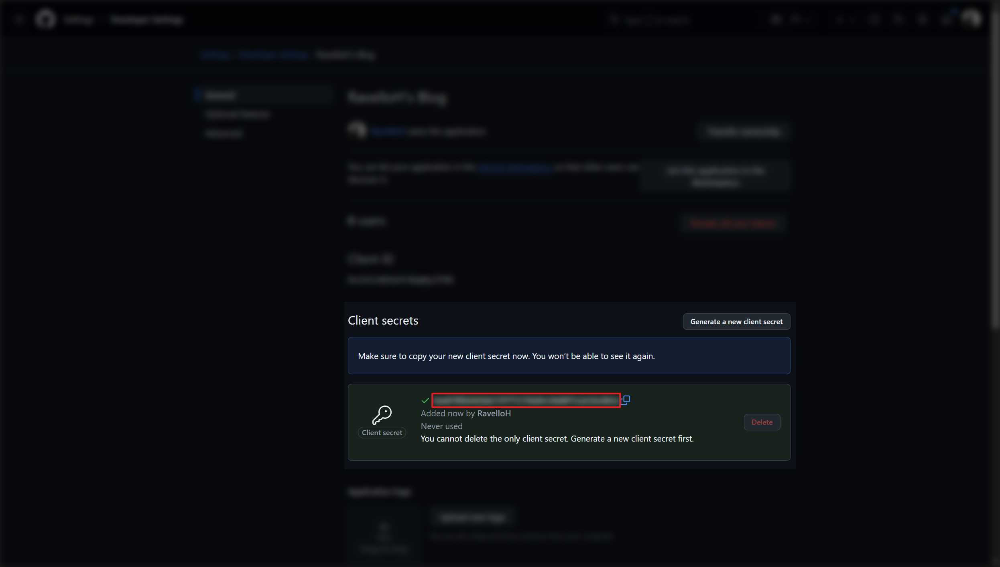
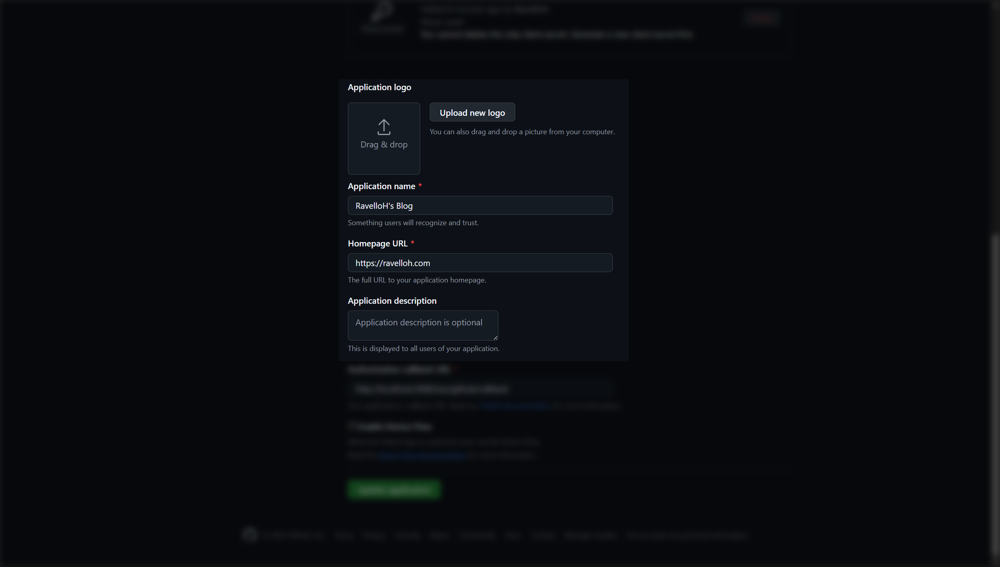

## 步骤

<div className="fd-steps">
<div className="fd-step">

### 1. 打开 OAuth 应用创建页面

前往 [GitHub Developer Settings](https://github.com/settings/developers)，点击 "New OAuth App" 按钮。



</div>
<div className="fd-step">

### 2. 填写应用信息

在打开的页面中，填写你的站点信息。注意，回调 URL 需要填写为：

```
https://your-domain.com/sso/github/callback
```



然后，点击 "Register application" 按钮。

</div>
<div className="fd-step">

### 3. 获取 Client ID

注册成功后，你会看到应用的详细信息页面。在这里，你可以找到你的 Client ID。

之后，你需要点击 "Generate a new client secret" 按钮来生成 Client Secret。



</div>
<div className="fd-step">

### 4. 获取 Client Secret

生成 Client Secret 后，页面会显示该密钥。请务必复制并保存该密钥，因为之后将无法再次查看。



</div>
<div className="fd-step">

### 5. （可选）补充应用信息

你可以在页面下方补充应用的 Logo、描述等信息。



</div>
<div className="fd-step">

### 6. 在 NeutralPress 中配置 SSO

在 NeutralPress 的管理面板中打开设置页面，然后选择“用户策略”标签页，将 `user.sso.github.enabled` 选项开启，并填写 `user.sso.github` 的 `clientId` 和 `clientSecret` 字段。

保存后，刷新页面，你就可以看到 GitHub 登录按钮出现在登录页面上了。

</div>
</div>
