## 步骤

<div className="fd-steps">
<div className="fd-step">

### 1. 打开 Google Cloud 控制台

前往 [Google Cloud 控制台](https://console.cloud.google.com/)，确保你已经登录了你的 Google 账户。

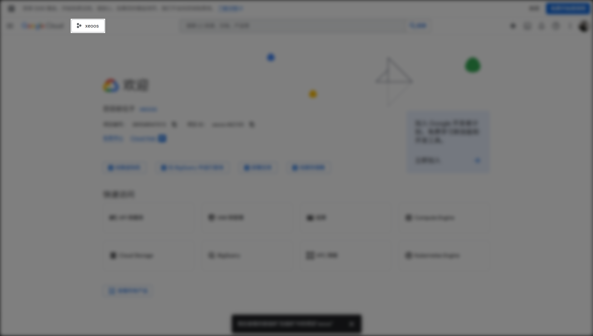

然后，打开左上角的项目选择器，新建（推荐）或选择一个已有项目。

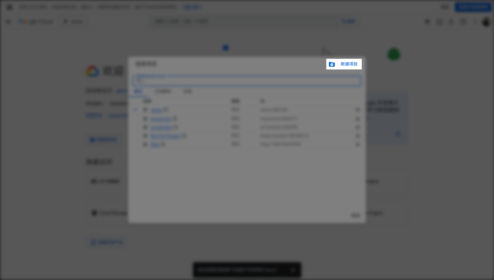

填写项目名，位置选择“无组织”，然后点击“创建”。

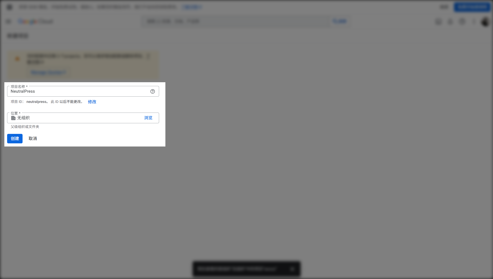

记得创建完之后，切换到这个新的项目。

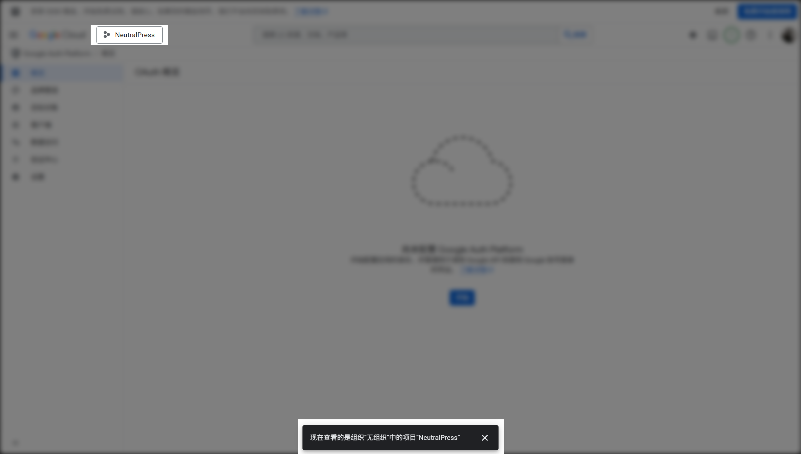

</div>
<div className="fd-step">

### 2. 创建新应用

在侧边栏选择 “API 和服务” > “OAuth 权限请求页面”。

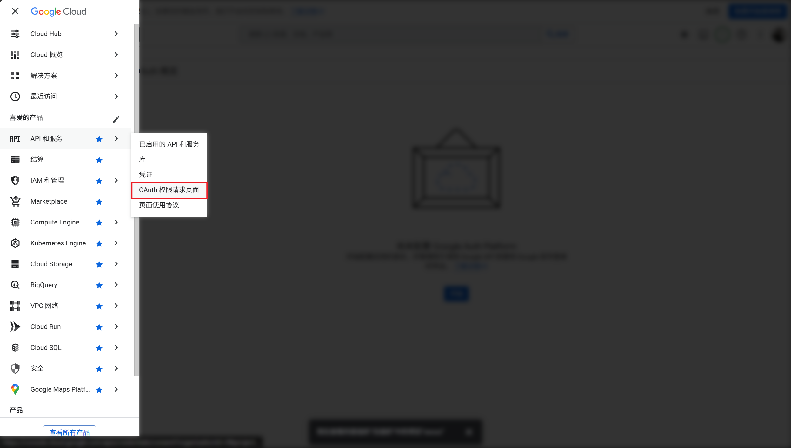

此时应该能看到页面提示“尚未配置 Google Auth Platform”，点击“开始”。

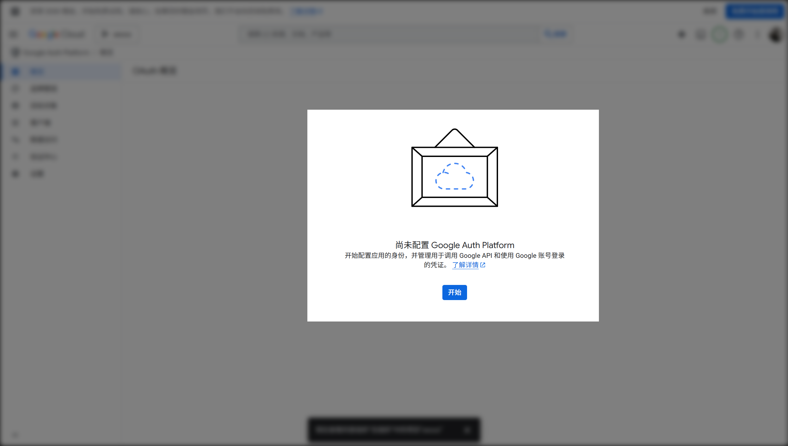

</div>
<div className="fd-step">

### 3. 配置应用信息

选择“外部”，然后点击“创建”。

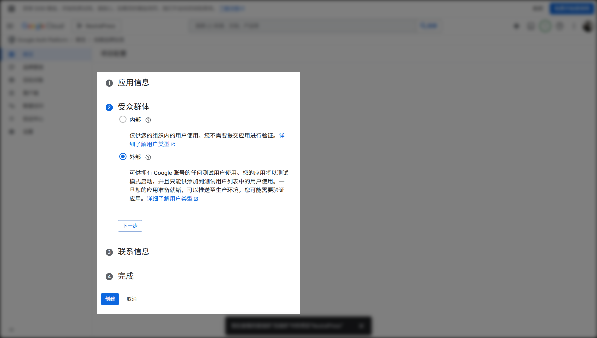

</div>
<div className="fd-step">

### 4. 创建 OAuth 客户端

点击“创建 OAuth 客户端”按钮。

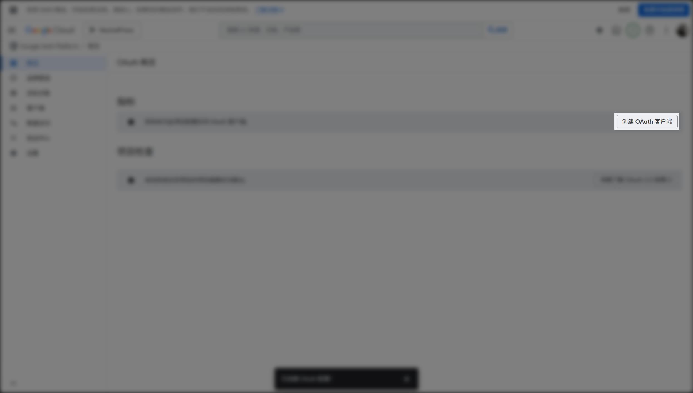

选择“Web 应用”。

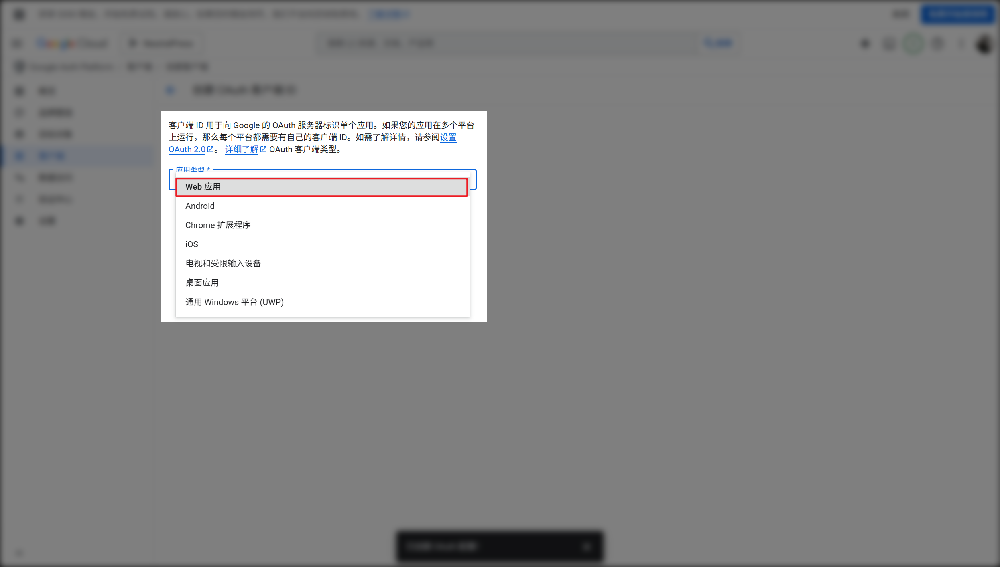

填写“已获授权的 JavaScript 来源”为你的网站域名，例如：

```
https://your-domain.com
```

（如果不需要本地测试，不用填第二个项。）

填写“已获授权的重定向 URI”为：

```
https://your-domain.com/sso/google/callback
```

（如果不需要本地测试，不用填第二个项。）

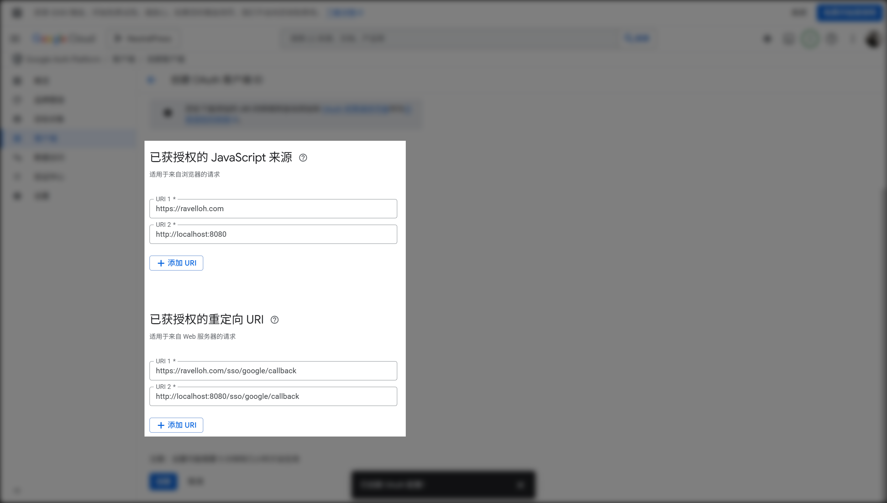

然后，点击“创建”，复制弹窗中的“客户端 ID”。

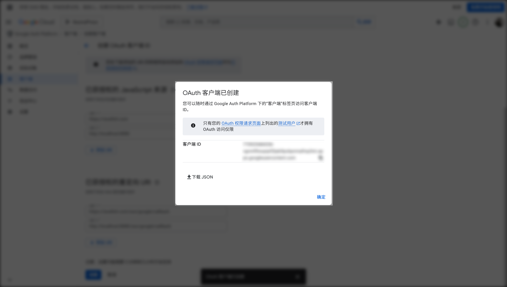

</div>
<div className="fd-step">

### 5. 获取客户端密钥

选择你刚创建的 OAuth 客户端，点击查看详情

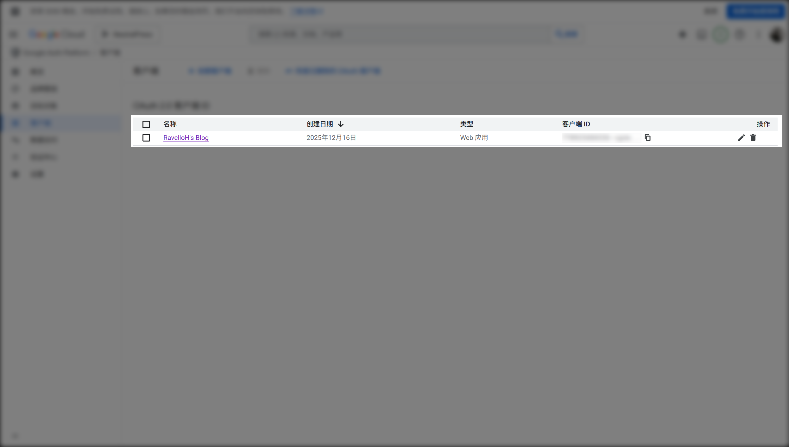

在右侧的“客户端密钥“部分，复制客户端密钥。

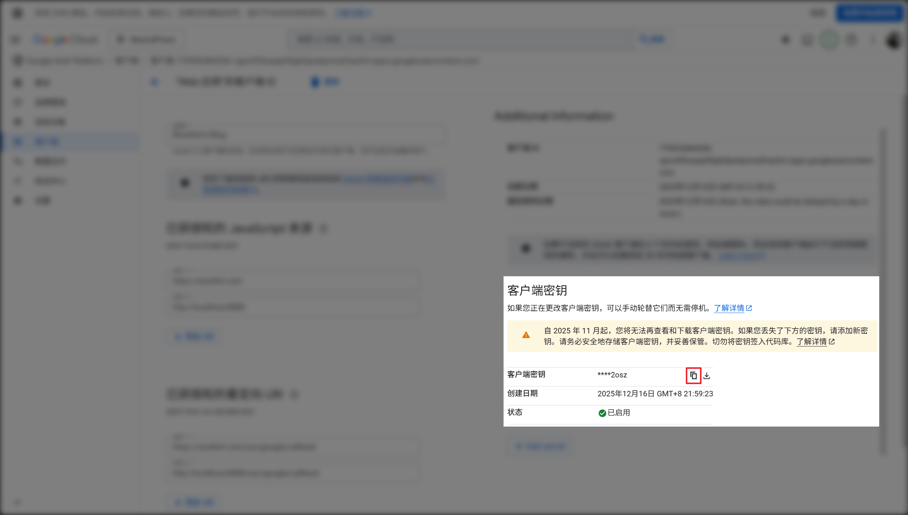

</div>
<div className="fd-step">

### 6.（可选）设置应用信息

你可以在“品牌塑造”页面补充应用的 Logo、描述等信息。

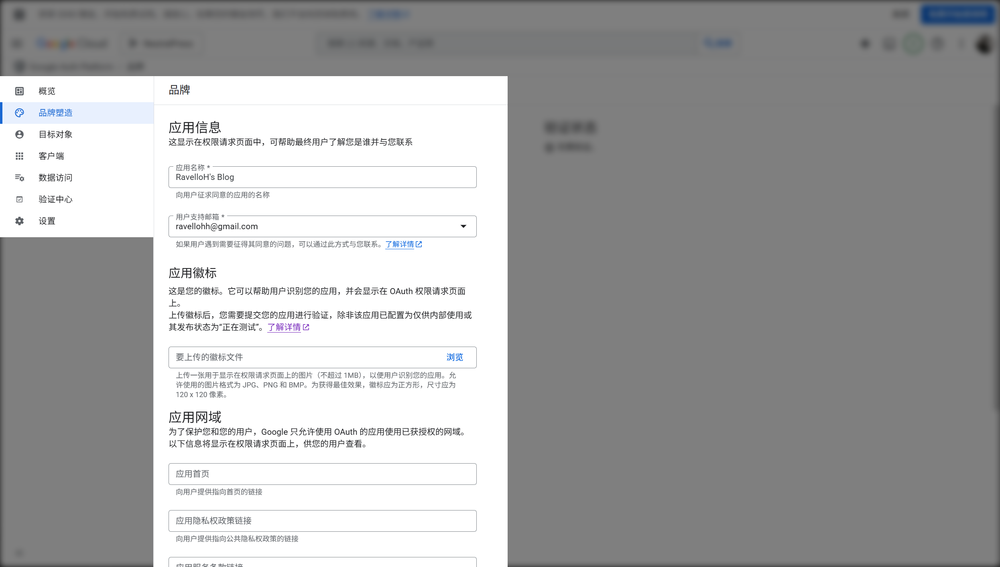

此外，上述操作之后，你的 App 状态默认是“测试中”，最多只能有 100 个用户使用该应用。如果你需要更多用户使用，需要点击“目标对象”页面顶部的“发布应用”按钮，将应用状态改为“已发布”。

</div>
<div className="fd-step">

### 7. 在 NeutralPress 中配置 SSO

在 NeutralPress 的管理面板中打开设置页面，然后选择“用户策略”标签页，将 `user.sso.google.enabled` 选项开启，并填写 `user.sso.google` 的 `clientId` 和 `clientSecret` 字段。

保存后，刷新页面，你就可以看到 Google 登录按钮出现在登录页面上了。

</div>
</div>
