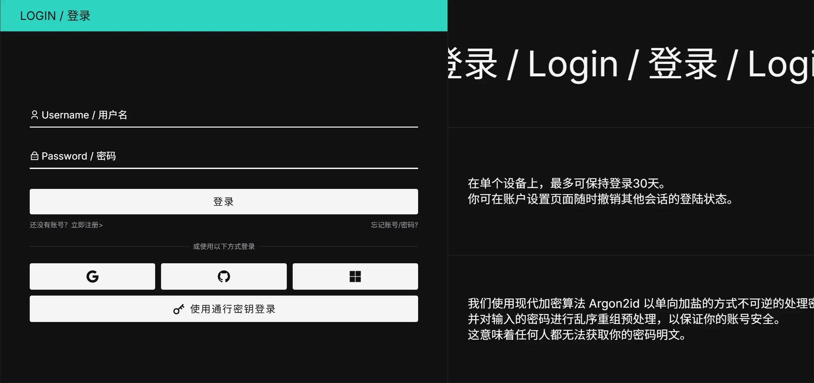

## 介绍

SSO（单点登录）允许用户直接使用第三方账户登录或注册 NeutralPress。

目前，NeutralPress 支持以下 SSO 提供商：

- GitHub
- Google
- Microsoft

这些提供商都是免费提供认证服务的，并且应该能覆盖大部分用户的需求。

## 配置流程

要启用对应的 SSO 提供商，您需要：

- 在创建一个 OAuth 应用，并获取其密钥和ID
- 在 NeutralPress 设置页面中填写密钥，并启用对应的提供商

应用创建过程，请查看下面的分步指南。

<Cards>
  <Card title="Github" href="/docs/settings/sso/github">
    6 步即可完成 Github SSO 的配置。
  </Card>
  <Card title="Microsoft" href="/docs/settings/sso/microsoft">
    5 步即可完成 Microsoft SSO 的配置。
  </Card>
  <Card title="Google" href="/docs/settings/sso/google">
    7 步即可完成 Google SSO 的配置。
  </Card>
</Cards>
