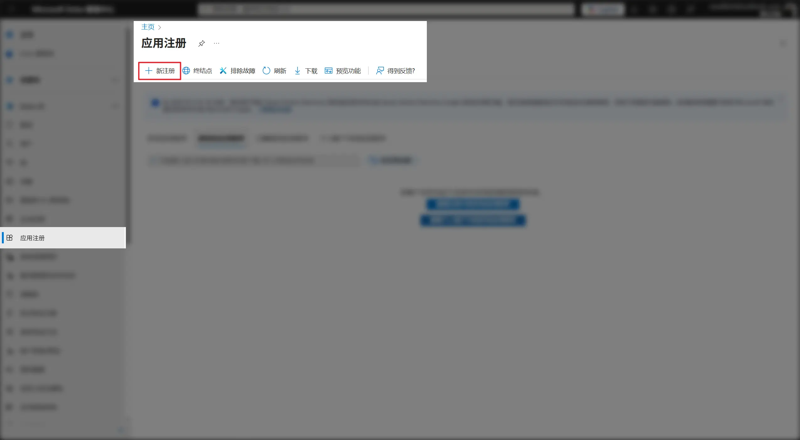
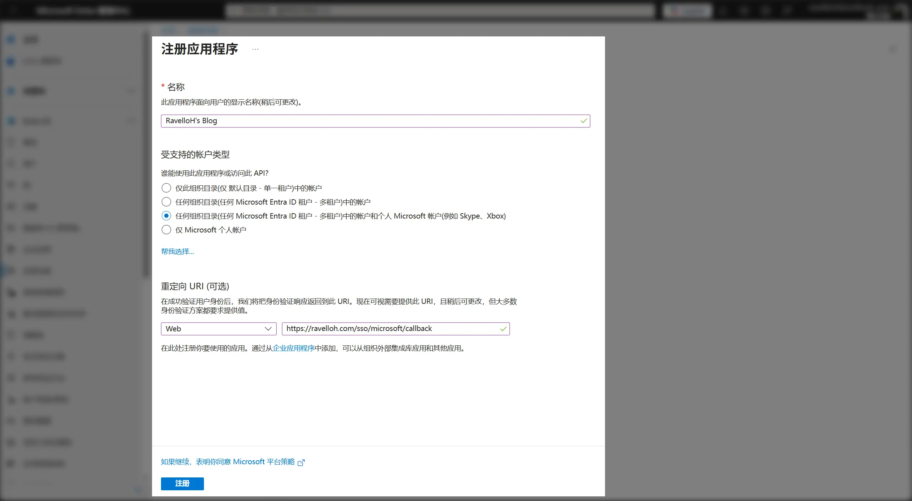
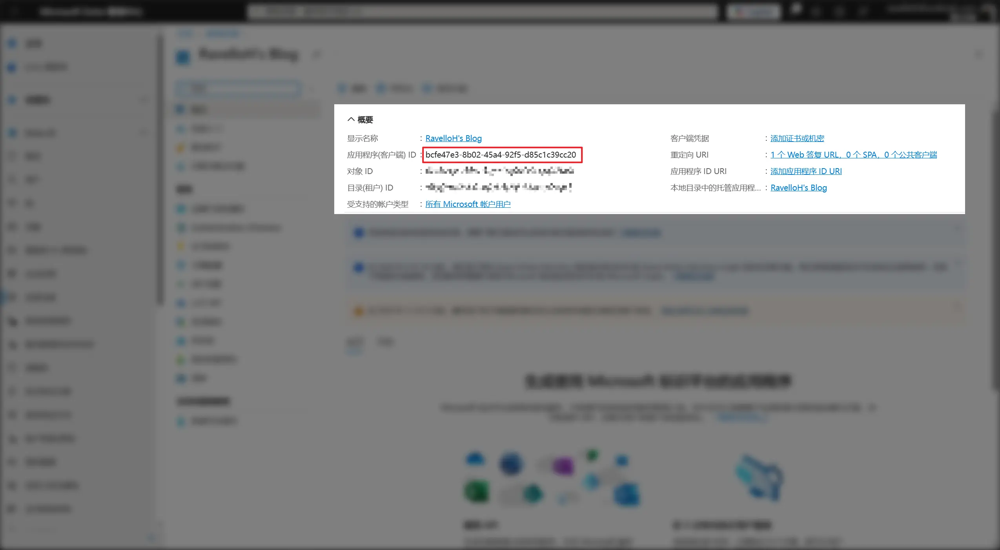
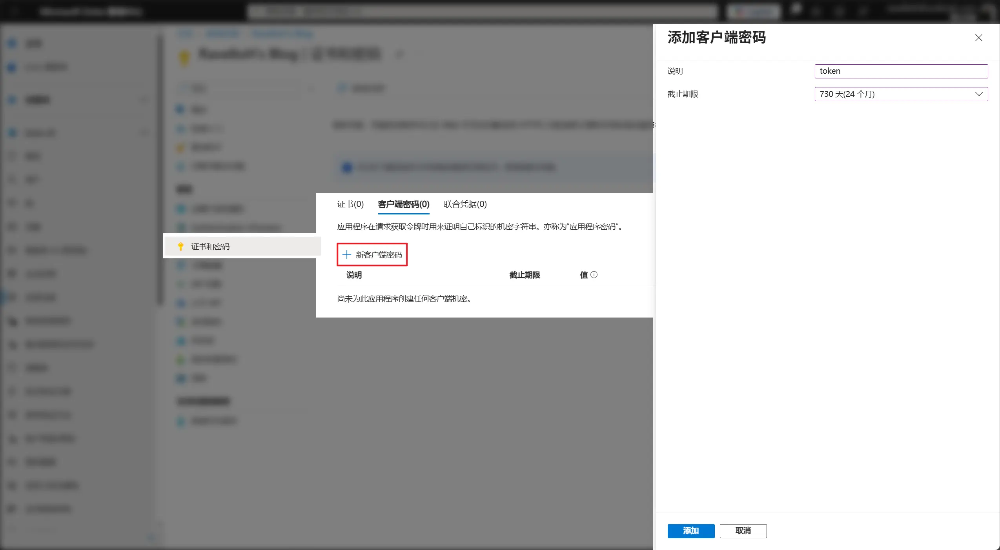
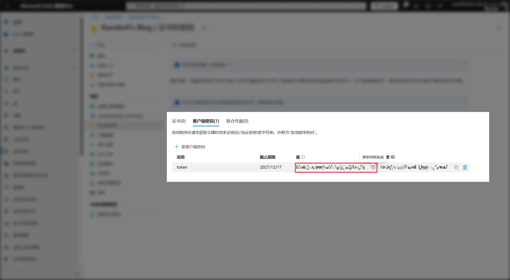

## 步骤

<div className="fd-steps">
<div className="fd-step">

### 1. 打开 Azure 应用注册页面

前往 [Azure App Registrations](https://portal.azure.com/#blade/Microsoft_AAD_RegisteredApps/ApplicationsListBlade)，或直接搜索“应用注册”，然后点击 "新注册" 按钮。



</div>
<div className="fd-step">

### 2. 填写应用信息

在打开的页面中，填写你的站点信息。其中：

- 受支持的账户类型：选“任何组织目录中的账户和个人 Microsoft 账户”
- 重定向 URI：选择“Web”，并填写为：

```
https://your-domain.com/sso/microsoft/callback
```



然后，点击 "注册" 按钮。

</div>
<div className="fd-step">

### 3. 获取 Client ID

注册成功后，你会看到应用的详细信息页面。在这里，你可以找到你的 Client ID。



</div>
<div className="fd-step">

### 4. 获取 Client Secret

转到“证书和密码”，选择“客户端密码”选项卡，点击 "新客户端密码" 按钮来生成 Client Secret。截止日期可以长一些，否则过期之后需要重新生成。



然后，复制生成的密钥的“值”。



</div>
<div className="fd-step">

### 5. 在 NeutralPress 中配置 SSO

在 NeutralPress 的管理面板中打开设置页面，然后选择“用户策略”标签页，将 `user.sso.microsoft.enabled` 选项开启，并填写 `user.sso.microsoft` 的 `clientId` 和 `clientSecret` 字段。

保存后，刷新页面，你就可以看到 Microsoft 登录按钮出现在登录页面上了。

</div>
</div>
