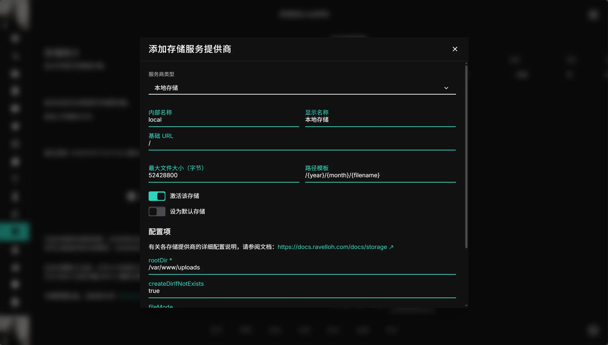

## 介绍

本地存储仅在 Docker 或者 源码运行环境中可用。不能在 Serverless 环境（例如 Vercel、Netlify 等）中使用。

## 配置

### 1. 打开设置页面

打开 NeutralPress 的管理面板，进入“存储管理”页面，点击添加存储服务商，选择本地存储。

### 2. 配置存储

内部名称与显示名称随便填，基础url填`/`。

值得注意的是`rootDir`字段，表示文件将存储在服务器的哪个目录下。建议填写绝对路径，例如 `/var/www/uploads` 。

<include>../../../part/storage-path-template.md</include>

保存成功后，你就成功添加了一个本地存储服务商。

