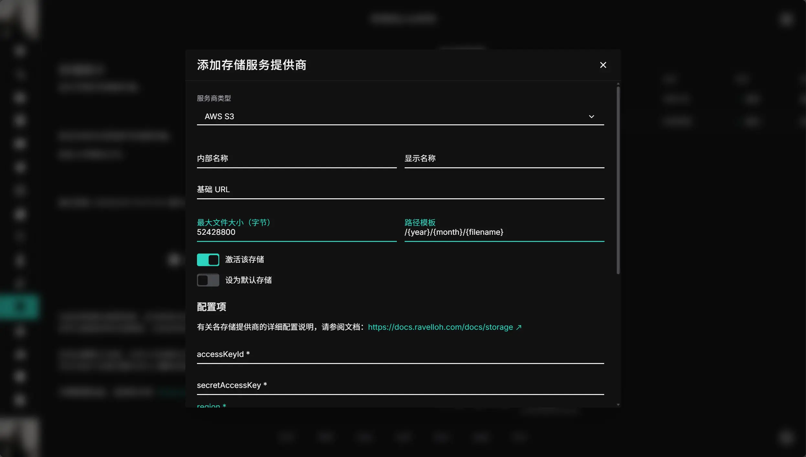
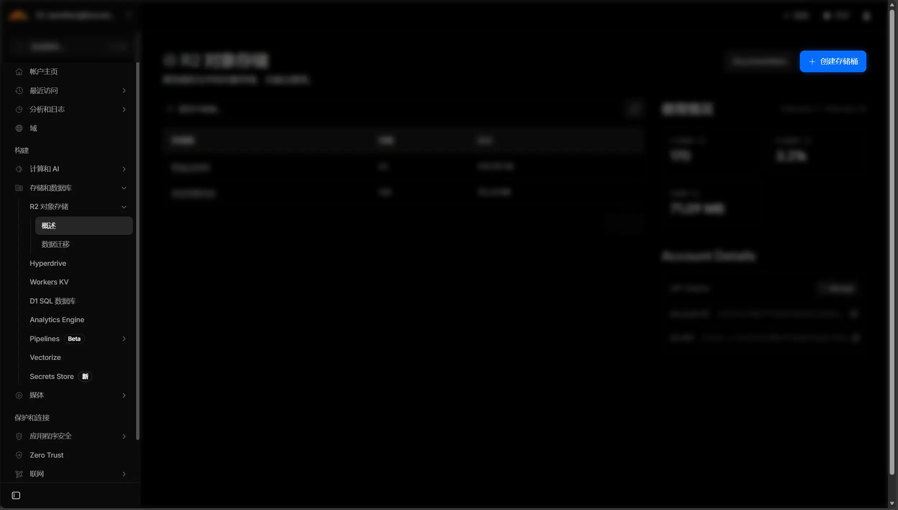
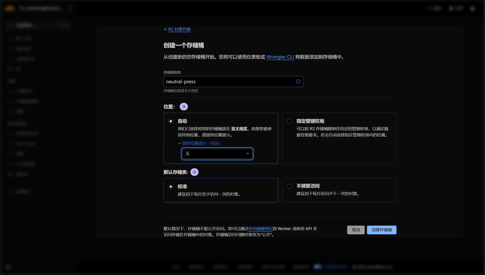
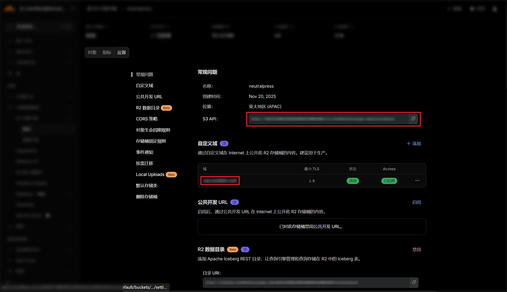
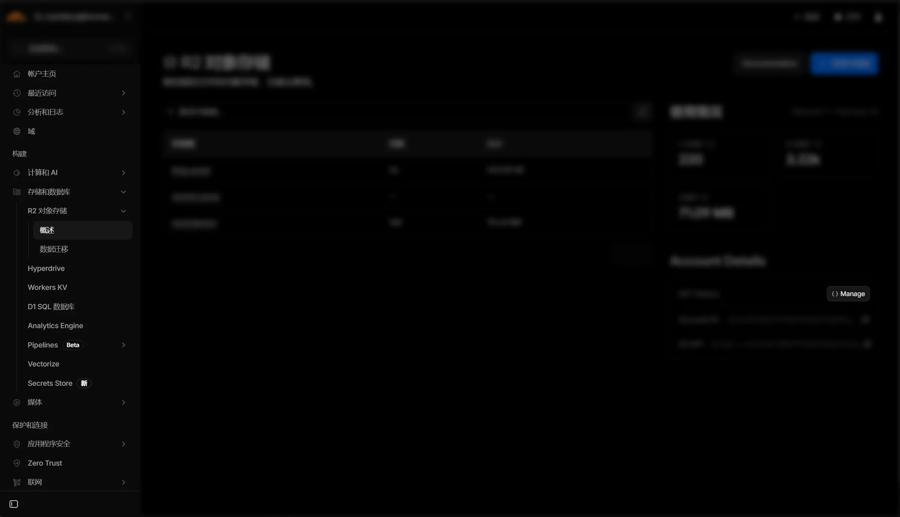
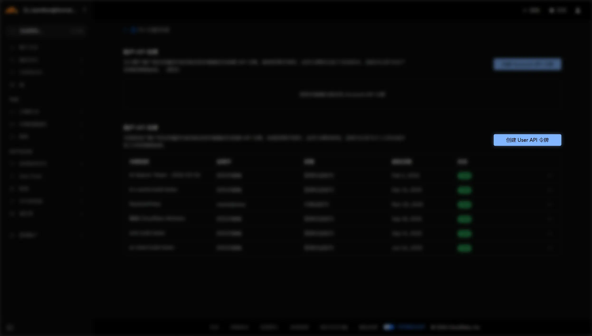
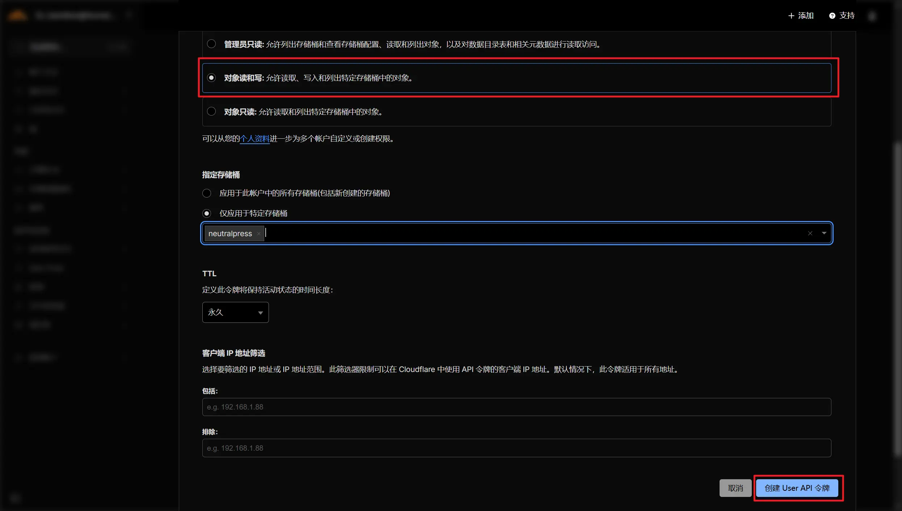
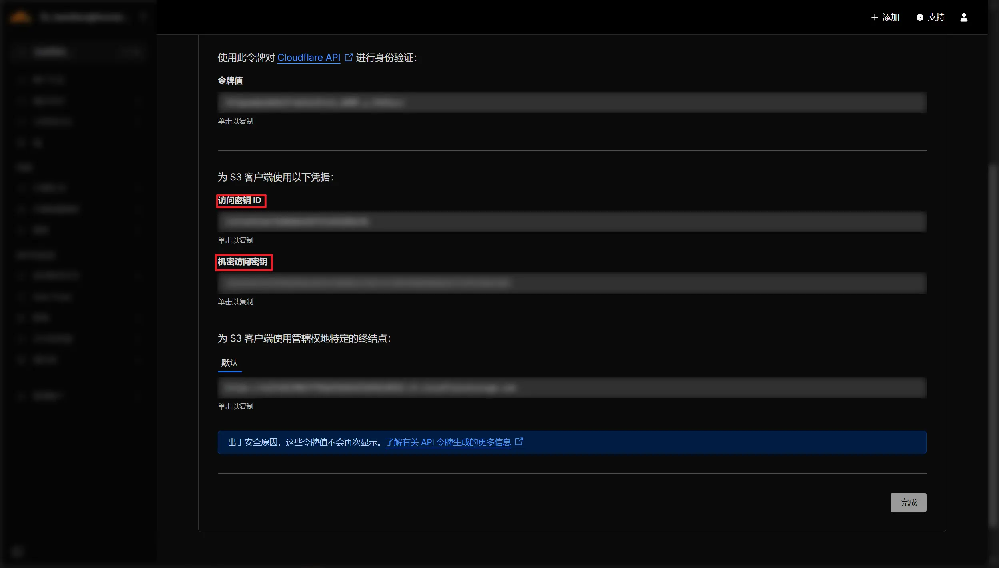

## 介绍

NeutralPress 支持使用 Amazon S3 作为存储后端。你也可以使用任何兼容 S3 协议的存储服务，例如 Cloudflare R2、阿里云 OSS 等。

下面我们以 Cloudflare R2 为例，介绍如何配置 S3 存储。其余的兼容 S3 协议的存储服务，配置方法类似。

## 步骤

<div className="fd-steps">
<div className="fd-step">

### 1. 打开 NeutralPress 设置页面

打开 NeutralPress 的管理面板，进入“存储管理”页面，点击添加存储服务商，选择Amazon S3。



</div><div className="fd-step">

### 2. 创建 R2 存储桶

前往 [Cloudflare R2 控制台](https://dash.cloudflare.com)，创建一个新的存储桶（Bucket）。





</div>
<div className="fd-step">

### 3. 获取 基础 URL 、endpoint 和 bucket

创建完成后，进入设置页面。将其中的“S3 API”复制下来。应该类似这样：

```text
https://xxxxxxxxxxxxxxxxxxx.r2.cloudflarestorage.com/yyyyyyyy
```

将其分为两部分，`https://xxxxxxxxxxxxxxxxxxx.r2.cloudflarestorage.com`填入 NeutralPress 的 `endpoint` 字段，`yyyyyyyy`填入 `bucket` 字段。

点击下方的“自定义域”，创建的URL填入 NeutralPress 的 `基础 URL` 字段。填进去的时候，记得加上协议头 `https://` 。



### 4. 创建 Access Key 和 Secret Key

回到概述页面，点击右侧的“Manage”按钮



点击“创建 User API 令牌”按钮



选择“对象读和写”，并应用于你刚才创建的存储桶



创建完成后，你会看到 Access Key 和 Secret Key，分别叫做“访问密钥 ID”和“机密访问密钥”。



</div>
<div className="fd-step">

### 5. 在 NeutralPress 中配置 S3 存储

分别填入上述五种字段：`基础 URL`、`endpoint`、`bucket`、`accessKeyId` 和 `secretAccessKey`。

然后，将 `region` 字段填为 `auto` ，`forcePathStyle` 字段写成 `true`，保存即可。

NeutralPress 会自动测试连接是否成功。如果成功，存储服务将立即生效。

</div>
</div>
