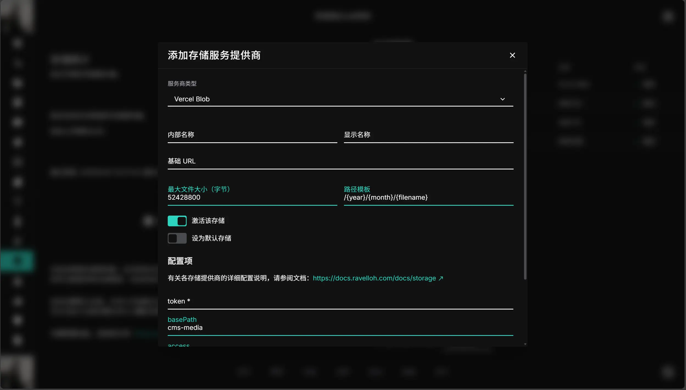
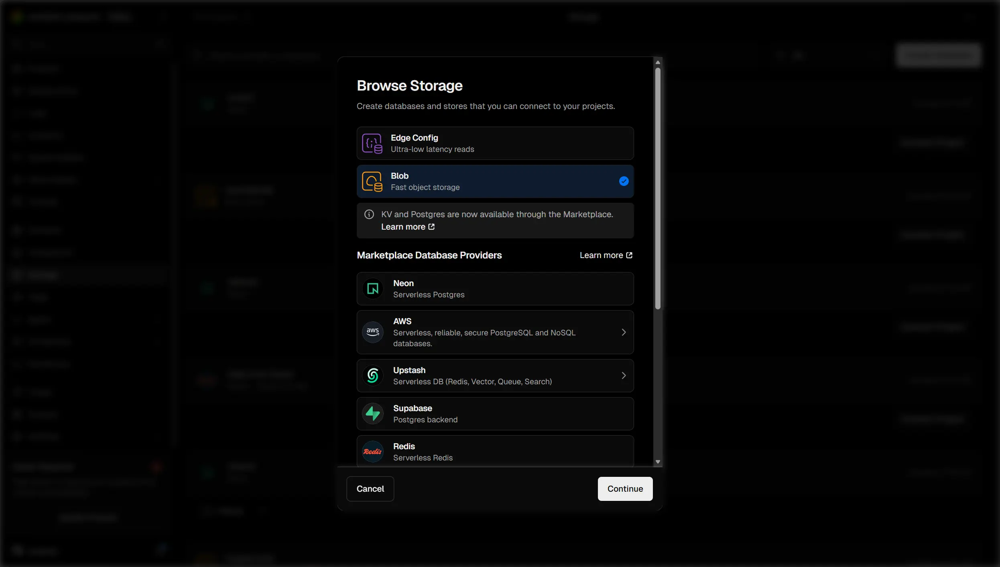
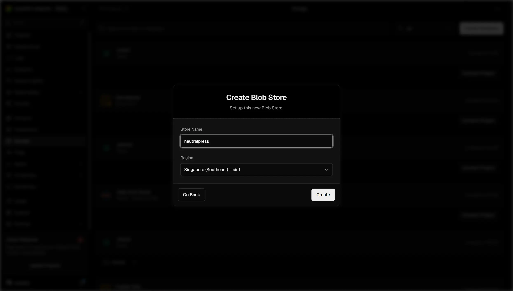
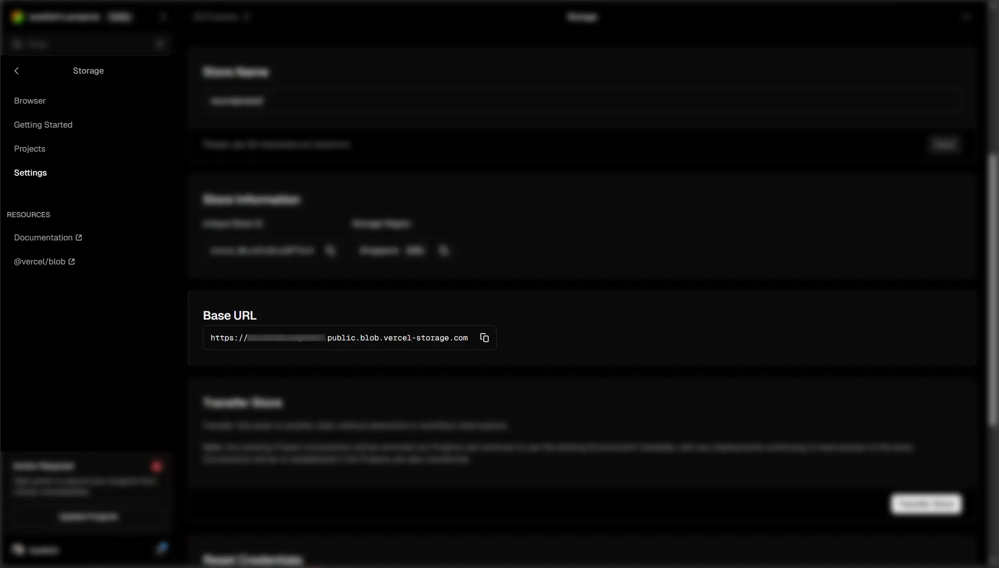

## 介绍

使用 Vercel 提供的 Blob 存储服务，适合部署在 Vercel 平台上的应用。

## 配置

### 1. 打开 NeutralPress 设置页面

打开 NeutralPress 的管理面板，进入“存储管理”页面，点击添加存储服务商，选择Vercel Blob。

### 2. 创建 Vercel Blob 存储空间

前往 [Vercel Blob 控制台](https://vercel.com/blob)，创建一个新的存储空间（Bucket）。

选择 Blob 存储类型

填写名称，选个离你的部署区域近的区域。部署区域的选择参考本文档的 Vercel 部署部分。

### 3. 获取 Token 和 基础 URL

进入详情页面，点击`.env.local`标签页，点击`Show secret`按钮，复制 token 值。

进入设置页面，复制 Base URL 值。

### 4. 在 NeutralPress 中配置 Vercel Blob

将上一步获取的 Token 和 Base URL 填入 NeutralPress 的相应字段中。

保存后，存储服务将立即生效。

